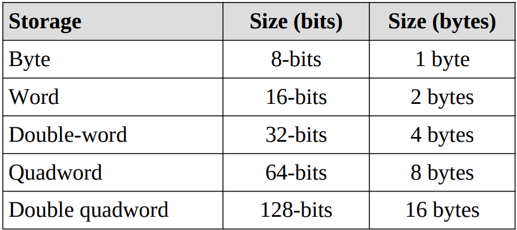
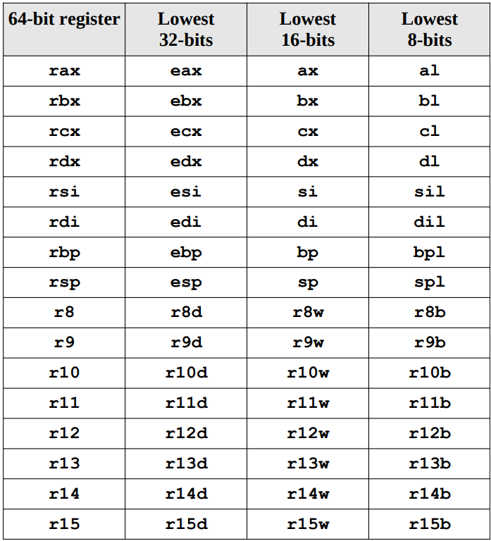

# Introduction

Assembly language is a “low-level” language and provides the basic instructional interface to the computer processor.

It is as close to the processor as you can get as a programmer.

Assembly is the essentially the human readable version of machine code.

While machine code is just 1's and 0's in giant files, assembly is the text version of what those ones and zeros mean.

A byte operation might mean move eax ebx and so on.

Everything in assembly is just binary (1's and 0's) there is no concept of data type and other HLL stuff.

The only main difference is addresses VS data.

- Data is stored in memory at a specific address and the address is usually represented in some hex value but to assembly this is still just a number.
- It's how we treat the data that we're representing that makes it a character or a string or an array for us.

# More on Assembly

The only interface a programmer has above the actual hardware is the kernel itself.

In order to build useful programs in assembly we need to use the linux `system calls` provided by the kernel.

- These system calls are a library built into the operating system to provide functions such as reading input from a keyboard and writing output to the screen.

When you invoke a system call the kernel will immediately suspend execution of your program. It will then contact the necessary drivers needed to perform the task you requested on the hardware and then return control back to your program.

- Drivers are called drivers because the kernel literally uses them to drive the hardware.

We can accomplish this all in assembly by loading RAX with the **function number (operation code OPCODE)** we want to execute and **filling the remaining registers with the arguments we want to pass to the system call**.

- A software interrupt is requested with the `syscall` instruction and the kernel takes over and calls the function from the library with our arguments.

Assembly language gives you direct control of the system's resources. This involves setting processor registers, accessing memory locations, and interfacing with other hardware elements.

- This requires a significantly deeper understanding of exactly how the processor and memory work.

The tool chain is the name for the process of taking code written by a human and converting it into something that the computer can directly execute.

- This includes the compiler, or assembler, the linker, the loader, and the debugger.

# Why Learn Assembly

1. Gain a Better Understanding of Architecture Issues.
1. Understanding the Tool Chain
1. Improve Algorithm Development Skills
1. Improve Understanding of Functions/Procedures
1. Gain an Understanding of I/O Buffering
1. Understand Compiler Scope
1. Introduction to Multi-processing Concepts
1. Introduction to Interrupt Processing Concepts

# Basic Processor Architecture

The basic components of a computer include a Central Processing Unit (CPU), Primary Storage or Random Access Memory (RAM), Secondary Storage, Input/Output devices (e.g., screen, keyboard, mouse), and an interconnection referred to as the Bus.

Programs and data are typically stored on secondary storage (e.g., disk drive or solid state drive).

- When a program is executed, it must be copied from secondary storage into the primary storage or main memory (RAM).
- The CPU executes the program from primary storage or RAM.

The x86-64 architecture supports a specific set of data storage size elements, all based on powers of two.

- The supported storage sizes are as follows:
  

- Lists or arrays (sets of memory) can be reserved in any of these types.
- These storage sizes have a direct correlation to variable declarations in high-level languages (e.g., C, C++, Java, etc.).

The CPU chip includes a number of functional units, including the **Arithmetic Logic Unit** (ALU) which is the part of the chip that actually performs the arithmetic and logical calculations.

- In order to support the ALU, processor registers and cache memory are also included “on the die” (term for inside the chip).

A **CPU register**, or just register, is a temporary storage or working location built into the CPU itself (separate from memory).

- Computations are typically performed by the CPU using registers.
- There are sixteen, 64-bit General Purpose Registers (GPRs).
  - A GPR register can be accessed with all 64-bits or some portion or subset accessed.
    
  - In addition to the GPRs, there is a special register, **rip**, which is used by the CPU to point to the next instruction to be executed.
    - Specifically, since the rip points to the next instruction, that means the instruction being pointed to by rip, and shown in the debugger, has not yet been executed.
    - This is an important distinction which can be confusing when reviewing code in a debugger.
  - The flag register, `rFlags`, is used for status and CPU control information.
    - The rFlag register is updated by the CPU after each instruction and not directly accessible by programs.
    - This register stores status information about the instruction that was just executed.
- XMM Registers are a set of dedicated registers used to support 64-bit and 32-bit floating-point operations and Single Instruction Multiple Data (SIMD) instructions.
  - The SIMD instructions allow a single instruction to be applied simultaneously to multiple data items.
  - Typical applications include some graphics processing and digital signal processing.
  - They are a total of 16 XMM registers each of 128 bits starting from xmm0 till xmm15.
  - Some of the more recent X86-64 processors support 256-bit XMM registers.
  - XMM registers are also used to support the Streaming SIMD Extensions (SSE).

Cache Memory is a small subset of the primary storage or RAM located in the CPU chip.

- If a memory location is accessed, a copy of the value is placed in the cache. Subsequent accesses to that memory location that occur in quick succession are retrieved from the cache location (internal to the CPU chip).
- Comparatively, if a value is in cache, it would be much faster to access that value.
- A cache hit occurs when the requested data can be found in a cache, while a cache miss occurs when it cannot.
- Successive generations of CPU chips have increased cache memory and improved cache mapping strategies in order to improve overall performance.
- Current chip designs typically include an L1 cache per core and a shared L2 cache. Many of the newer CPU chips will have an additional L3 cache.

# Data Representation

Data representation refers to how information is stored within the computer.

There is a specific method for storing integers which is different than storing floating-point values which is different than storing characters.

If not specified, a number is in base-10. Additionally, a number preceded by 0x is a hex value.

# Skeleton of a assembly program

3 main sections are section .data, section .bss and section .text

`section .text` contains label in it, it'll have multiple labels, which are essentially marked addresses in your code that are stored in a table.

- When you jump to labels you will reference that table and essentially know where to go in your code.
- The text section always has one label in it's either \_start or main(depending on compiler) so it's either one of these two and it depends on.

In `section .data` we define constant variables i.e. strings, magic numbers, terminating strings etc, basically anything that you already know the value of will go here

`segment .bss` is for reserving space in memory for future data, basically a variable.

# Converting Assembly code to Machine Code

There are 2 steps to compiling assembly,

- A linker or an assembler in this case we use the nasm assembler this will convert your assembly code into essentially the machine version of it and what this outputs is a .o file.
- The next step you have to do is you have to link your code one of the big things linking does is it actually combines multiple libraries it also does a couple other things to clean up your code.
  - There are two different ways you can link the first is using the dynamic linker ld (wants \_start label) and the second is to use gcc (wants main label).

# Registers

Registers are hardware impleneted variables.

- Basically a set of transistors in the chip that holds data and it is only 32 (eax) or 64 (rax) bits wide but it is a hard-coded variable and it will always exist.

These are the things that you perform operations on so when you want to perform operations on data you have to load them.

We have different sizes of registers

- 8 bit registers are al, bl, cl, dl
- 16 bit registers are ax, bx, cx, dx
- 32 bit registers are eax, ebx, ecx, edx
- 64 bit registers are rax, rbx, rcx, rdx

Main general purpose registers are eax, ebx, ecx, edx (rax, rbx, rcx, rdx are the 64 bit counterparts)

We can access the lower bits of these registers using al, bl, cl and dl which are the lower 8 bits, the lower 16 bits are accessed by ax, bx, cx, dx.

If we write something in these registers they can change the values in eax or rax series.

eax or rax is the accumelator registor as this is used as the result meaning most of the arithmetic operations are stored in eax.

ecx or rcx is generally used for counters as we use it for incrementing and loop iterator variables.

- There are actually hardware implementations of operands that allow us to do increments slightly faster or with a little more efficiency if we use this register.

esi and edi are also general purpose registers and are used mainly for copying large pieces of data, esi is source index and edi is destination index.

You also have two pointers to the stack one at the bottom (ebp -> base pointer) and one at the top (esp -> stack pointer).

- The top one will be moved every time you add or remove the data from the stack that's the esb (the stack pointer)
- and then ebp (the base pointer) points to the bottom of the stack so that you have a reference of how large your stack is
- Stack is empty when these two point to the same address

# Common Operands

1. mov dest, src -> it is to copy data from source to dest

1. and dest, src -> dest &= src

1. or dest, src -> dest &= src

1. xor dest, src -> dest &= src

1. test dest, src -> check if both are same and update the flag register

1. add eax, ebx -> eax += ebx

1. sub eax, ebx -> eax -= ebx

1. mul and div are unary

- mul bx -> dx:ax = ax\*bx this is because the multiplication can be more than 16 bits so the lower 16 is on ax and the upper ones are on dx
- div bx -> ax R dx = dx:ax/bx this is quitiont is on ax and the remainder is on dx
- The same extends to the larger memory register as well

# Flag Registers

1. They are updated after every operation anc can only be 0 or 1.

1. CF -> carry flag

1. OF -> overflow flag

1. ZF -> operation results in zero

1. SF -> sign change (1 is negetive and 0 is positive)

1. PF -> 1 is even 0 is odd

# Jump operations (normal and conditional jump)

1. jmp label

1. We can all a n after j in any of the below to make them not like

1. jne -> jump not equal

1. je -> jump equal

1. jbe -> jump below equal

1. jae -> jump above equal

1. jb -> jump below equal

1. ja -> jump above equal

1. jle -> jump less equal

1. jge -> jump greater equal

1. jc -> jump carry

1. jo -> jump overflow

1. jz -> jump zero

1. js -> jump sign

# Call (Advanced Jump)

- call label

# Comparision

cmp eax, ebx -> this basically compare the two registers and update the flag registers

After the cmp we usually have jump operation because any other operation may change the flag registers and then we might not get the desired results

# shifting bits

shr eax, 1 -> basically divide by 2 to power 1

shl eax, 4 -> basically multiply by 2 to power 4

# Note

[] in assembly are used for de-referencing and is used with pointers.

# Addressing Mode

The only way to access memory is with the brackets ([]'s). Omitting the brackets will not access memory and instead obtain the address of the item.

# NASM Language

Like most assemblers, each NASM source line contains (unless it is a macro, a preprocessor directive or an assembler directive) some combination of the four fields.

- `label: instruction operands ; comment`
- Most of these fields are optional; the presence or absence of any combination of a label, an instruction and a comment is allowed.
- The operand field is either required or forbidden by the presence and nature of the instruction field.

NASM uses backslash (\\) as the line continuation character; if a line ends with backslash, the next line is considered to be a part of the backslash-ended line.

NASM places no restrictions on white space within a line.

The colon after a label is also optional.

Valid characters in labels are letters, numbers, \_, $, #, @, ~, ., and ?.

- The only characters which may be used as the first character of an identifier are letters, .(with special meaning), \_ and ?.
- An identifier may also be prefixed with a $ to indicate that it is intended to be read as an identifier and not a reserved word; thus, if some other module you are linking with defines a symbol called eax, you can refer to $eax in NASM code to distinguish the symbol from the register.
- Maximum length of an identifier is 4095 characters.

The instruction field may contain any machine instruction: Pentium and P6 instructions, FPU instructions, MMX instructions and even undocumented instructions are all supported.

Instruction operands may take a number of forms: they can be registers, described simply by the register name (e.g. ax, bp, ebx, cr0), or they can be effective addresses, constants or expressions.

- NASM does not use the gas–style syntax in which register names must be prefixed by a % sign

Pseudo-instructions are things which, though not real x86 machine instructions, are used in the instruction field anyway because that's the most convenient place to put them.

- The current pseudo-instructions are `DB`, `DW`, `DD`, `DQ`, `DT`, `DO`, `DY` and `DZ`; their uninitialized counterparts `RESB`, `RESW`, `RESD`, `RESQ`, `REST`, `RESO`, `RESY` and `RESZ`; the `INCBIN` command, the `EQU` command, and the `TIMES` prefix.

DB, DW, DD, DQ, DT, DO, DY and DZ are used, much as in MASM, to declare initialized data in the output file.

RESB, RESW, RESD, RESQ, REST, RESO, RESY and RESZ are designed to be used in the BSS section of a module: they declare uninitialized storage space.

- Each takes a single operand, which is the number of bytes, words, doublewords or whatever to reserve.
- The operand to a RESB–type pseudo-instruction is a critical expression.
