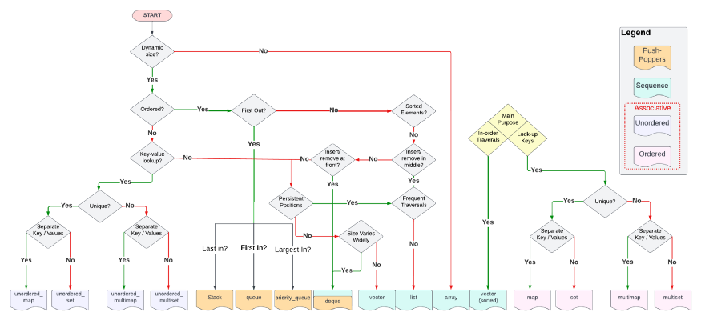
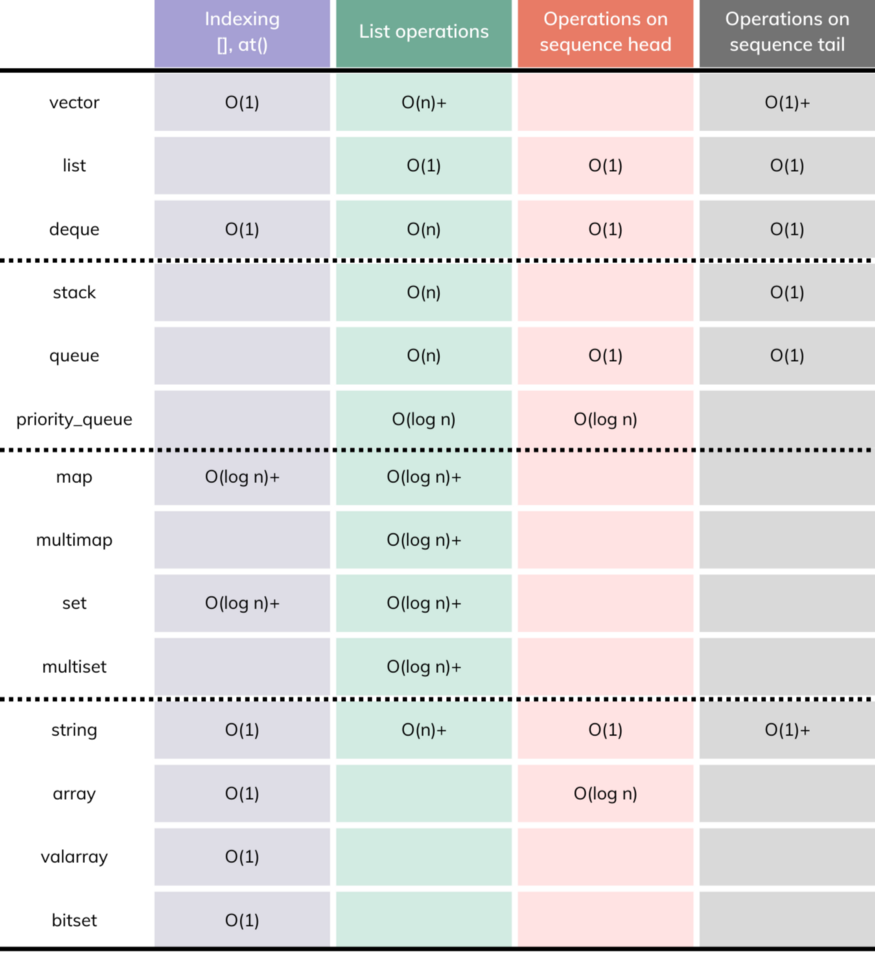

# Introduction

This is just a quick warning note about those folks who use the built-in libraries available at their programming language blindly; without having a clear idea about the complexity and how it’s being implemented.

Lemme tell you how serious this is:

- You may get a logarithmic running time for an associative array, while you’re expecting a constant time in average. This is because it’s being implemented using self-balancing binary search tree instead of using hash tables.

- If you’re trying to sort an already sorted array or numbers, and the built-in sort function uses quicksort, you may get a quadratic time if the sort function doesn’t shuffle the array.

- A data structure that uses a linked list instead of an array may take a linear time to access an element and consume extra memory for the links and node creation and management.

- A sorting algorithm that makes poor use of cache memory like heapsort (since it points to nodes far away from each other) is not the same as using a sorting algorithm that checks nearby elements like quicksort, which in turn makes it slower in a lot of situations where caching is important.

- A sorting algorithm that uses extra space for the auxiliary array of size N like in mergesort is not the same as sorting in-place like in quicksort.

- A hash table implemented using “linear probing” as a collision resolution technique has a better cache performance over “separate chaining” technique as traversing a linked list has poor cache performance, making the processor cache ineffective.

- A hash table with a load factor tends to zero has more wasted space unless the hash table uses a resizing array to make sure the table is always at a suitable size; less wasteful and saves memory.

# Standard Library

In C++, this is the standard library, having been in continuous integration for major releases spanning from C++98 to C++23.

The C++ SL offers many things like iostream, ostream, istream etc but its core is the STL. Remember Sl also provides string classes, numeric classes, the standard version of stream I/O classes, basic memory allocation, exception classes, run-time type information.

# STL

STL has 4 components:

- Algorithms
- Containers
- Functors
- Iterators

## Motivation

We have the program (e.g., imports, the control flow, i/o), and there are the external resources (e.g., data). With data read into memory without any structure, we want to organize data points in a container (i.e., a data structure).

We also have to manipulate this data which can be done using algorithms.

Usually, if we want to support A algorithms and C containers, we'd need A × C implementation. We would have to implement A algorithms for each container C. One solution to this is to use polymorphism. But it would decrease efficiency. STL solves the problem with iterators. A container provides the iterators for implemented algorithms to work. As a result, STL needs to provide only A + C implementations for A algorithms and C containers.

## Why use STL

They’re simply better than their competition, regardless of whether that competition comes from containers in other libraries or is a container type you’d write yourself. STL containers aren’t just good. They’re really good.

## Containers

Containers or container classes store objects and data. There are in total seven standards “first-class” container classes and three container adaptor classes and only seven header files that provide access to these containers or container adaptors.

**Sequence Containers**: implement data structures that can be accessed in a sequential manner.

- vector
- list
- deque
- arrays
- forward_list

**Container Adaptors**: provide a different interface for sequential containers.

- queue
- priority_queue
- stack

**Associative Containers**: implement sorted data structures that can be quickly searched (O(log n) complexity).

- set
- multiset
- map
- multimap

**Unordered Associative Containers**: implement unordered data structures that can be quickly searched

- unordered_set (Introduced in C++11)
- unordered_multiset (Introduced in C++11)
- unordered_map (Introduced in C++11)
- unordered_multimap (Introduced in C++11)

### Chosing the Right Container

