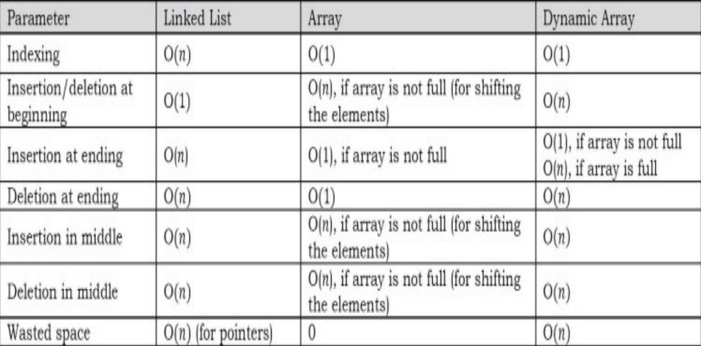

# Concepts in Linked List

- **Singly Linked List**
- **Unrolled Linked List**
- **Skip List**
- **Doubly Linked List**
- **Memory Efficient Doubly Linked List[XOR Linked List]**
- **Circular Linked List**

# Competitors

# Singly Linked List

A linked list is a linear data structure that includes a series of connected nodes. Here, each node stores the data and the address of the next node.

We give the address of the first node a special name called **HEAD**.

The last node in the linked list also called the **TAIL** can be identified because its next portion points to NULL.

Each node consists:

- A data item
- An address of next node

## Complexity Analysis

Time Complexity of Worst case and Average case

- Search O(n)
- Insert O(1)
- Deletion O(1)

Space Complexity: O(n)

# Unrolled Linked List

One of the biggest advantages of linked lists over arrays is that inserting an element at any location takes only O(1). However, to search an element in a linked list takes O(n).

- To solve the problem of searching i.e. reducing the time for searching the element the concept of unrolled linked lists was put forward.

The unrolled linked list covers the advantages of both array and linked list as it reduces the memory overhead in comparison to simple linked lists by storing multiple elements at each node and it also has the advantage of fast insertion and deletion as that of a linked list.

With unrolled linked lists, there are a couple of advantages, one in speed and one in space.

Since we have O(n/m) links, where n is the number of elements in the unrolled linked list and m is the number of elements we can store in any block, we can also save an appreciable amount of space, which is particularly noticeable if each element is small.

# Skip List

Binary trees can be used for representing abstract data types such as dictionaries and ordered lists.

- Balanced tree algorithms rearrange the tree as operations are performed to maintain certain balance conditions and assure good performance.

The worst case search time for a sorted linked list is O(n) as we can only linearly traverse the list and cannot skip nodes while searching. For a Balanced Binary Search Tree, we skip almost half of the nodes after one comparison with root. For a sorted array, we have random access and we can apply Binary Search on arrays.

Skip lists are a probabilistic alternative to balanced trees. It is a data structure that can be used as an alternative to balanced binary trees.

- As compared to a binary tree, skip lists allow quick search, insertion and deletion of elements. This is achieved by using probabilistic balancing rather than strictly enforce balancing.
- It is basically a linked list with additional pointers such that intermediate nodes can be skipped.
- It uses a random number generator to make some decisions.
- The find, insert, and remove operations on ordinary binary search trees are efficient, O(logn), when the input data is random; but less efficient, O(n), when the input data is ordered.
- Skip List performance for these same operations and for any data set is about as good as that of randomly built binary search trees - namely O(logn).

In an ordinary sorted linked list, search, insert, and delete are in O(n) because the list must be scanned node-by-node from the head to find the relevant node.

- If somehow we could scan down the list in bigger steps, we would reduce the cost of scanning. This is the fundamental idea behind Skip Lists.
- Skip Lists allow intermediate nodes in the list to be skipped during a traversal - resulting in an expected performance of O(logn) per operation.

In simple terms, Skip Lists are sorted linked lists with two differences:

- The nodes in an ordinary list have one next reference. The nodes in a Skip List have many next references (also called forward references).
- The number of forward references for a given node is determined probabilistically.

# Doubly Linked List

The advantage of a doubly linked list (also called two – way linked list) is that given a node in the list, we can navigate in both directions.

The primary disadvantages of doubly linked lists are:

- Each node requires an extra pointer, requiring more space.
- The insertion or deletion of a node takes a bit longer (more pointer operations).

Each node consists:

- A data item
- An address of previous node
- An address of next node

## Complexity Analysis

Time Complexity of Worst case and Average case

- Search O(n)
- Insert O(1)
- Deletion O(1)

Space Complexity: O(n)

# Memory Efficient Doubly Linked List[XOR Linked List]

A journal presented an alternative implementation of the doubly linked list ADT, with insertion, traversal and deletion operations.

- This implementation is based on pointer difference. Each node uses only one pointer field to traverse the list back and forth.

Each node consists:

- A data item
- A pointer difference (This contains the difference between the pointer to the next node and the pointer to the previous node.)

The pointer difference is calculated by using exclusive-or (⊕) operation.

- ptrdiff = pointer to previous node ⊕ pointer to next node.
- The ptrdiff of the start node (head node) is the ⊕ of NULL and next node (next node to head). Similarly, the ptrdiff of end node is the ⊕ of previous node (previous to end node) and NULL.

# Circular Linked List

In singly linked lists and doubly linked lists, the end of lists are indicated with NULL value. But circular linked lists do not have ends.

In circular linked lists, each node has a successor. The TAIL instead of pointing to NULL points to HEAD.

While traversing the circular linked lists we should be careful; otherwise we will be traversing the list infinitely.

Circular linked lists are used in managing the computing resources of a computer. We can use circular lists for implementing stacks and queues.

Each node consists:

- A data item
- An address of next node

## Complexity Analysis

Time Complexity of Worst case and Average case

- Search O(n)
- Insert O(1)
- Deletion O(1)

Space Complexity: O(n)

# Problems

1. Find nth node from the end of a Linked List.

- M\-1: Brute-Force Method.

  - Start with the first node and count the number of nodes present after that node. If the number of nodes is < n – 1 then return saying “fewer number of nodes in the list”. If the number of nodes is > n – 1 then go to next node. Continue this until the numbers of nodes after current node are n – 1.
  - Time Complexity: O(n^2), for scanning the remaining list (from current node) for each node.
  - Space Complexity: O(1).

- M\-2: Using Hash table.

  - Create a hash table whose entries are <position of node, node address>. That means, key is the position of the node in the list and value is the address of that node(like array). By the time we traverse the complete list (for creating the hash table), we can find the list length(M). So nth from the end of linked list is M-n+1th from the beginning. Since we already know the length of the list, it is just a matter of returning M-n+1th key value from the hash table.
  - Time Complexity: Time for creating the hash table, O(m).
  - Space Complexity: Since we need to create a hash table of size m, O(m).

- M\-3: Using the concept that nth element from the end in a list is M-n+1th from the beginning.

  - Using a loop find the length M of the list and then just loop till M-n+1 and the required node will be found. This solution needs two scans: one for finding the length of the list and the other for finding M–n+1th node from the beginning.
  - Time Complexity: Time for finding the length + Time for finding the M – n + 1th node from the beginning. Therefore, T(n) = O(n) + O(n) ≈ O(n).
  - Space Complexity: O(1).

- M\-4: Using 2 pointer technique (Single Scan).

  - Use two pointers p1 and p2. Initially, both point to head node of the list. p1 starts moving only after p2 has made n moves. After the distance of n node is made both move forward until p2 reaches the end of the list. The Idea is to keep a distance of n between them so when the later one reach the end the former will be n node away from the end.
  - Time Complexity: O(n).
  - Space Complexity: O(1).

2. Finding Cycles/Loop/Ring in linked list. Check whether the given linked list is NULL-terminated or not. If there is a cycle find the start node of the loop and the length of the loop.

- M\-1: Using Hash table.

  - Traverse the linked list nodes one by one. Check if the address of the node is available in the hash table or not. If it is already available in the hash table, that indicates that we are visiting the node that was already visited. This is possible only if the given linked list has a loop in it. If the address of the node is not available in the hash table, insert that node’s address into the hash table. Continue this until we reach the end of the linked list or we find the loop.
  - If the loop is present then the first common node will be the start of the loop.
  - To find the length of the loop just start a counter which increments at the rate of 1 when any address's frequency gets to 2 and keep counting till any ones frequency gets 3.
  - Time Complexity: O(n) for scanning the linked list.
  - Space Complexity: O(n) for hash table.

- M\-2: Memoryless Approach (Floyd cycle finding algorithm).

  - It uses two pointers moving at different speeds to walk the linked list. Once they enter the loop they are expected to meet, which denotes that there is a loop as the only way a faster moving pointer would point to the same location as a slower moving pointer is if somehow the entire list or a part of it is circular. (Think this as Turtle-Rabbit race in a loop).
  - After finding the loop in the linked list, we initialize the slowPtr to the head of the linked list. From that point onwards both slowPtr and fastPtr move only one node at a time. The point at which they meet is the start of the loop. Generally this method is used for removing the loops.
  - After finding the loop in the linked list, keep the fastPtr as it is. The slowPtr keeps on moving until it again comes back to fastPtr. While moving slowPtr, use a counter variable which increments at the rate of 1.
  - Time Complexity: O(n).
  - Space Complexity: O(1).

3. Reverse a singly linked list.

- M\-1: Using stack

- M\-2:

4. Merge two sorted lists (in-place)

- M\-1: Iterative way.

  - Traverse the list from start to end.
  - If the head node of second list lies in between two nodes of the first list, insert it there and make the next node of second list the head. Continue this until there is no node left in both lists, i.e. both the lists are traversed.
  - If the first list has reached end while traversing, point the next node to the head of second list.
