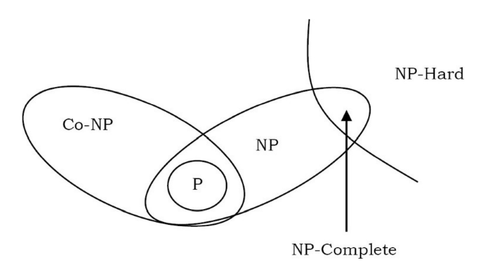

# Introduction

An algorithm is the step-by-step unambiguous instructions to solve a given problem.

In CS, multiple algorithms are available for solving the same problem (for example, a sorting problem has many algorithms, like insertion sort, selection sort, quick sort and many more).

- Algorithm analysis helps us to determine which algorithm is most efficient in terms of time and space consumed.

- The goal of the analysis of algorithms is to compare algorithms (or solutions) mainly in terms of running time but also in terms of other factors (e.g., memory, developer effort, etc.)

In the traditional study of algorithms, there are two main criteria for judging the merits of algorithms:

- correctness (does the algorithm give solution to the problem in a finite number of steps?)
- efficiency (how much resources (in terms of memory and time) does it take to execute the algorithm).

To compare algorithms, we can define a few objective measures:

- **Execution times**: Not a good measure as execution times are specific to a particular computer (Hardware dependent).
- **Number of statements executed**: Not a good measure, since the number of statements varies with the programming language as well as the style of the individual programmer.
- **Rate of Growth**: Let us assume that we express the running time of a given algorithm as a function of the input size n (i.e., f(n)) and compare these different functions corresponding to running times. This kind of comparison is independent of machine time, programming style, etc.

The rate at which the running time increases as a function of input is called rate of growth.

# Asymptotic Notations

To analyze an algorithm we need some kind of syntax, and that forms the base for asymptotic analysis/notation.

Asymptotic notations are mathematical tools to represent the time complexity of algorithms for asymptotic analysis.

The following 3 asymptotic notations are mostly used to represent the time complexity of algorithms:

- Θ Notation (Average Case)
- Big O Notation (Worst Case)
- Ω Notation (Best Case)

When it comes to analyzing algorithms, the asymptotic analysis seems to be the best way possible to do so. This is because asymptotic analysis analyzes algorithms in terms of the input size. It checks how are the time and space growing in terms of the input size.

Most of the times, we do the worst case analysis to analyze algorithms. In the worst analysis, we guarantee an upper bound on the running time of an algorithm which is a good piece of information.

The average case analysis is not easy to do in most of the practical cases and it is rarely done. In the average case analysis, we must know (or predict) the mathematical distribution of all possible inputs.

The Best Case analysis is bogus. Guaranteeing a lower bound on an algorithm doesn't provide any information as in the worst case, an algorithm may take years to run.

# Rate of Growth for Time and Space Complexity

The time complexity of an algorithm estimates how much time the algorithm will use for some input.

A time complexity does not tell us the exact number of times the code is executed, but it only shows the order of magnitude.

If the algorithm consists of consecutive phases, the total time complexity is the largest time complexity of a single phase.

- For example, if a code consists of three phases with time complexities O(n), O(n^2) and O(n). The total time complexity is O(n^2).

Sometimes the time complexity depends on several factors. In that case, the time complexity formula contains several variables.

- But keep in mind that the complexity is always determined in terms of the input size n, m etc.

The time complexity of a recursive function depends on the number of times the function is called and the time complexity of a single call. The total time complexity is the product of these values.

- Time complexity of Reccursive function is calculated using **Master theroem**.

Some common time complexities are **O(1) < O(log(n)) < O(root(n)) < O(n) < O(nlog(n)) < O(n^k) < O(k^n) < O(n!)**.

- A polynomial time complexity roughly means that the algorithm is efficient, basically all the above time complexity except k^n and n!.

## General Complexity Rules

There are some general rules to help us determine the running time of an algorithm:

- **Loops**: The running time of a loop is, at most, the running time of the statements inside the loop (including tests) multiplied by the number of iterations.

- **Nested loops**: Analyze from the inside out. Total running time is the product of the sizes of all the loops.

- **Consecutive statements**: Add the time complexities of each statement.

- **If-then-else statements**: Worst-case running time: the condition, plus either the then part or the else part (whichever is the larger).

- **Logarithmic complexity**: An algorithm is O(logn) if it takes a constant time to cut the problem size by a fraction (usually by ½) or increases or by a factor of n.

When we analyse any two algorithms we usually neglect lower terms and constants, because if two algorithms have
different Big O times, the constant doesn’t matter.

- This is only good but if both the algorithms have different curve equation.

- But sometimes the constant can make a difference. Quicksort versus merge sort is one example. Quicksort has a smaller constant than merge sort. So if they’re both O(n log n) time, quicksort is faster.

## Time Complexity for Reccurance Relation

Many algorithms are recursive. When we analyze them, we get a recurrence relation for time complexity.

The performance of a recursive procedure is usually dictated by the size and number of subproblems, rather than the amount of work per recursive call or time spent at the base of the recursion.

- If subproblems are smaller than the original by an additive factor, the solution is most often exponential.
- If the subproblems are only a fraction the size of the original, then the solution is typically bounded by a polynomial.

There are many ways of solving recurrences:

1. Guess and Verify Method
   - The key step is identifying a pattern in the problem.
   - Whenever you guess a solution to a recurrence, you should always verify it with a proof, typically by induction.
   - One big drawback is we have to guess right.
1. Substitution or Plug-and-chug method
   - The key factor here is spotting a pattern in a sequence of numbers or expressions
1. Reccurance Tree method
1. Akra-Bazzi method
1. Master theroem

If f(n) and g(n) are both solutions to a homogeneous linear recurrence, then h(n)=sf(n)+tg(n) is also a solution for all s,t∈R.

- A linear combination of solutions is another solution.

Any homogeneous linear recurrence; that is, a recurrence of the form `f(n)=a1*f(n−1)+a2*f(n−2)+⋯+ad*f(n−d)` where a1,a2,…,ad and d are constants. Substituting the guess `f(n) = x^n`then dividing by `x^(n−d)` gives `x^d=a1*x^(d−1)+a2*x^(d−2)+⋯+(ad−1)*x+ad`. This is called the characteristic equation of the recurrence. The characteristic equation can be read off quickly since the coefficients of the equation are the same as the coefficients of the recurrence. The solutions to a linear recurrence are defined by the roots of the characteristic equation.

- If `r` is a nonrepeated root of the characteristic equation, then `r^n` is a solution to the recurrence.
- If `r` is a repeated root with multiplicity `k` then `r^n`,`nr^n`,`(n^2*r^n)`,…,`(n^k−1*r^n)` are all solutions to the recurrence.

The solution to virtually all divide and conquer solutions is given by the amazing Akra-Bazzi formula.

There is a special case of the Akra-Bazzi formula known as the Master Theorem that handles some of the recurrences that commonly arise in computer science.

- It is called the Master Theorem because it was proved long before Akra and Bazzi arrived on the scene and, for many years, it was the final word on solving divideand-conquer recurrences.

# Amortized Analysis

# Complexity Classes

In computer science, in order to understand the problems for which solutions are not available, the problems are divided into classes and we call them as complexity classes.

In computational complexity theory, a complexity class is a set of computational problems of related resource-based complexity.

- The two most commonly analyzed resources are time and memory.

- It is the branch of theory of computation that studies the resources required during computation to solve a given problem.

There are a lot of complexity classes and many of these classes have a 'co' partner which consists of the complements of all languages in the original class.

**The hardest problems** of a class refer to problems which belong to the class such that every other problem of that class can be reduced to it. Furthermore, the reduction is also a problem of the given class, or its subset.

The problems that can be solved in theory as well as in practice are called tractable problems.

## P vs NP vs Co-NP vs NP-Hard vs NP-Complete

The complexity class P is the set of decision problems(problems with a “yes” or “no” answer) that can be solved by a deterministic machine in polynomial time (P stands for polynomial time).

- P problems are a set of problems whose solutions are easy to find.

- Solvable in polynomial time

The complexity class NP (NP stands for non-deterministic polynomial time) is the set of decision problems that can be solved by a non-deterministic machine in polynomial time.

- NP class problems refer to a set of problems whose solutions are hard to find, but easy to verify/validate.

- This means, if someone gives us a solution to the problem, we can tell them whether it is right or not in polynomial time.

- "Yes" answers can be checked in polynomial time.

Co – NP is the opposite of NP (complement of NP).

- If the answer to a problem in Co – NP is no, then there is a proof of this fact that can be checked in polynomial time.

- "No" answers can be checked in polynomial time

One of the important open questions in theoretical computer science is whether or not P = NP. Nobody knows. Intuitively, it should be obvious that P ≠ NP, but nobody knows how to prove it.

Another open question is whether NP and Co – NP are different. Even if we can verify every YES answer quickly, there’s no reason to think that we can also verify NO answers quickly. It is generally believed that NP ≠ Co – NP, but again nobody knows how to prove it.

An NP-hard problem is at least as hard as the hardest problem in NP and it is the class of the problems such that every problem in NP reduces to NP-hard.

- All NP-hard problems are not in NP, so it takes a long time to even check them.

- This means, if someone gives us a solution for NP-hard problem, it takes a long time for us to check whether it is right or not

- A problem K is NP-hard indicates that if a polynomial-time algorithm (solution) exists for K then a polynomial-time algorithm for every problem is NP.

A problem is NP-complete if it is part of both NP-hard and NP.

- NP-complete problems are special as any problem in NP class can be transformed or reduced into NP-complete problems in polynomial time.

- They are the hardest problems in NP.

- If anyone finds a polynomial-time algorithm for one NP-complete problem, then we can find polynomial-time algorithm for every NP-complete problem. This means that we can check an answer fast and every problem in NP reduces to it.

The set of problems that are NP-hard is a strict superset of the problems that are NP-complete.

## Reduction

We reduce (or transform) given NP-Complete problems to other known NP-Complete problem.

Since the NP-Complete problems are hard to solve and in order to prove that given NP-Complete problem is hard, we take one existing hard problem (which we can prove is hard) and try to map given problem to that and finally we prove that the given problem is hard.

It’s not compulsory to reduce the given problem to known hard problem to prove its
hardness. Sometimes, we reduce the known hard problem to given problem.

## P=NP

If P = NP, it means that every problem that can be checked quickly can be solved quickly.

- A **quick algorithm** (solution) means **not trial-and-error solution**. It could take a billion years, but as long as we do not use trial and error, it is efficient. Future computers will change those billion years to a few minutes.

- Remember the difference between checking if an answer is right and actually solving a problem.
