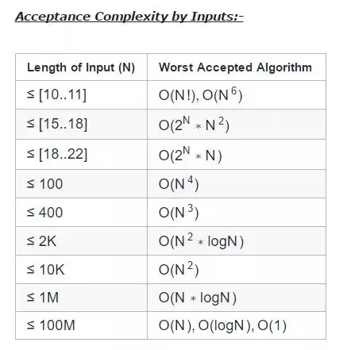
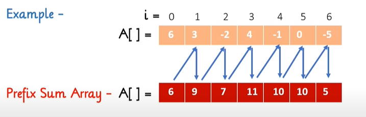

# **Time Complexity**

The time complexity of an algorithm estimates how much time the algorithm will use for some input.

A time complexity does not tell us the exact number of times the code is executed, but it only shows the order of magnitude.

If the algorithm consists of consecutive phases, the total time complexity is the largest time complexity of a single phase.

- For example, the following code consists of three phases with time complexities O(n), O(n^2) and O(n). Thus, the total time complexity is O(n^2).

Sometimes the time complexity depends on several factors. In that case, the time complexity formula contains several variables.

- But keep in mind that the complexity is always determined in terms of the input size n, m etc.

The time complexity of a recursive function depends on the number of times the function is called and the time complexity of a single call. The total time complexity is the product of these values.

- Time complexity of Reccursive function is calculated using **Master theroem**.

Some common time complexities are **O(1) < O(log(n)) < O(root(n)) < O(n) < O(nlog(n)) < O(n^k) < O(k^n) < O(n!)**.

- A polynomial time complexity roughly means that the algorithm is efficient, basically all the above time complexity except k^n and n!.

Generally, while doing competitive programming problems on various sites, the most difficult task faced is writing the code under desired complexity otherwise the program will get a TLE ( Time Limit Exceeded ).

Most of the sites these days allow 10^8 operations per second, only a few sites still allow 10^7 operations.

So We have to just make sure that even in the worst case our time complexity shouldn't exceed 10^8 operations which can be found by putting the max constraint as the value of n in the time complexity of the program, this is called 10^8 operation rule.

- eg
  1. 1 <= N <= 10^3
  - For Case 1: A naive solution that is using two for-loops works as it gives us a complexity of O(N^2), which even in the worst case will perform 10^6 operations which are well under 10^8. Ofcourse O(N) and O(NlogN) is also acceptable in this case.
  2. 1 <= N <= 10^5
  - For Case 2: We have to think of a better solution than O(N^2), as in worst case, it will perform 10^10 operations as N is 10^5. So complexity acceptable for this case is either O(NlogN) which is approximately 10^6 (10^5 \* ~10) operations well under 10^8 or O(N).
  3. 1 <= N <= 10^8
  - For Case 3: Even O(NlogN) gives us TLE as it performs ~10^9 operations which are over 10^8. So the only solution which is acceptable is O(N) which in worst case will perform 10^8 operations.

# Prefix Sum Array

It is a simple yet powerful technique that allows to perform fast calculation on the sum of elements in a given range(called contiguous segments of array).

`Computing range sum queries in constant time over a fixed 1D array.`

It takes O(n) time to calculate prefix sum array of n size array.
It takes O(1) time to perform range sum query onnsize array.

- Range sum query formula - A[i,j] = A[j]-A[i-1]

Given an array arr[] of size n, its prefix sum array is another array prefixSum[] of the same size, such that the value of prefixSum[i] is arr[0] + arr[1] + arr[2] … arr[i].

- eg. if arr[] = {10, 20, 10, 5, 15} then prefixSum[] = {10, 30, 40, 45, 60}

As `prefixSum[i] = prefixSum[i-1] + arr[i]` and for base case prefixSum[0] = arr[0] so to fill the prefix sum array, we run through index 1 to last and keep on adding the present element with the previous value in the prefix sum array.

Given a matrix (or 2D array) a[][] of integers. Let prefix sum matrix be psa[][]. The value of psa[i][j] contains sum of all values which are above it or on left of it basically a sub-rectangle.

Prefix array is a very vital tool in competitive programming. This helps to minimize the repeated calculation done in an array and thus reduces the time complexity of your program.

**If the given array A has all non-negative numbers then the prefix array constructed will be sorted in non-descending order.**

Applications

- **Equilibrium index of an array**: The equilibrium index of an array is an index such that the sum of elements at lower indexes is equal to the sum of elements at higher indexes.
- **Find if there is a subarray with 0 sum**: Given an array of positive and negative numbers, find if there is a subarray (of size at least one) with 0 sum.
- **Maximum subarray size, such that all subarrays of that size have sum less than k**: Given an array of n positive integers and a positive integer k, the task is to find the maximum subarray size such that all subarrays of that size have the sum of elements less than k.
- **Find the prime numbers which can written as sum of most consecutive primes**: Given an array of limits. For every limit, find the prime number which can be written as the sum of the most consecutive primes smaller than or equal to the limit.
- **Longest Span with same Sum in two Binary arrays**: Given two binary arrays, arr1[] and arr2[] of the same size n. Find the length of the longest common span (i, j) where j >= i such that arr1[i] + arr1[i+1] + …. + arr1[j] = arr2[i] + arr2[i+1] + …. + arr2[j].
- **Maximum subarray sum modulo m**: Given an array of n elements and an integer m. The task is to find the maximum value of the sum of its subarray modulo m i.e find the sum of each subarray mod m and print the maximum value of this modulo operation.
- **Maximum subarray size, such that all subarrays of that size have sum less than k**: Given an array of n positive integers and a positive integer k, the task is to find the maximum subarray size such that all subarrays of that size have sum of elements less than k.
- **Maximum occurred integer in n ranges**: Given n ranges of the form L and R, the task is to find the maximum occurring integer in all the ranges. If more than one such integer exits, print the smallest one.
- **Minimum cost for acquiring all coins with k extra coins allowed with every coin**: You are given a list of N coins of different denominations. you can pay an amount equivalent to any 1 coin and can acquire that coin. In addition, once you have paid for a coin, we can choose at most K more coins and can acquire those for free. The task is to find the minimum amount required to acquire all the N coins for a given value of K.
- **Random number generator in arbitrary probability distribution fashion**: Given n numbers, each with some frequency of occurrence. Return a random number with a probability proportional to its frequency of occurrence.
