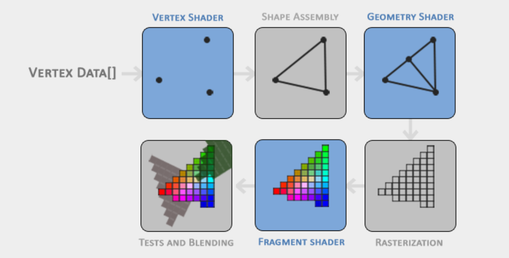
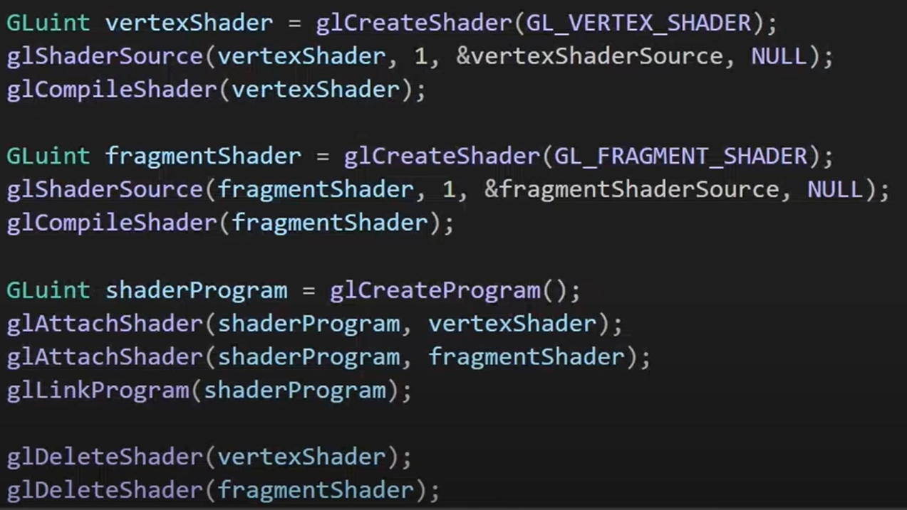
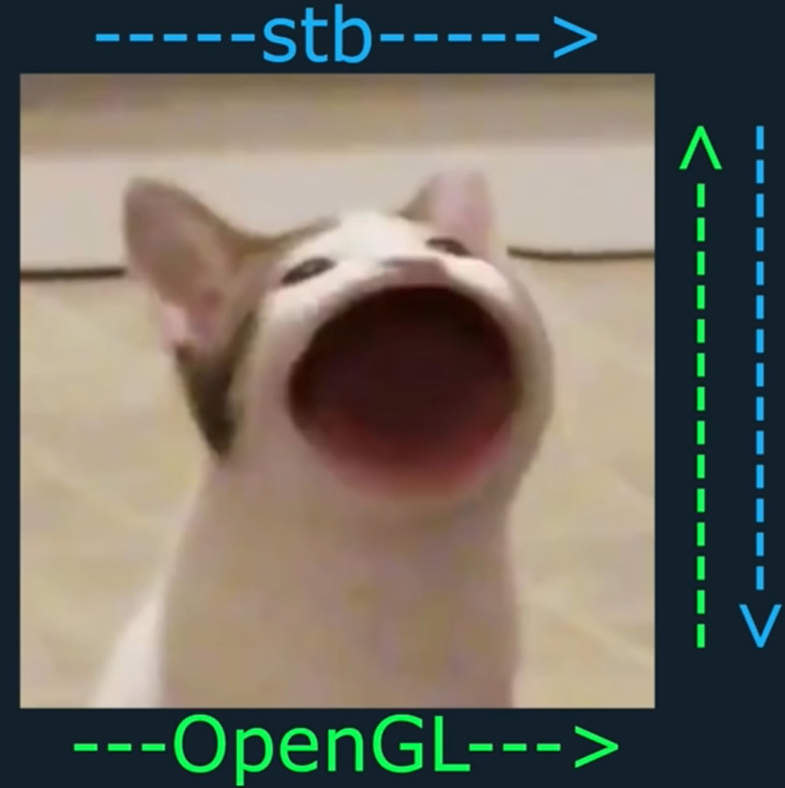
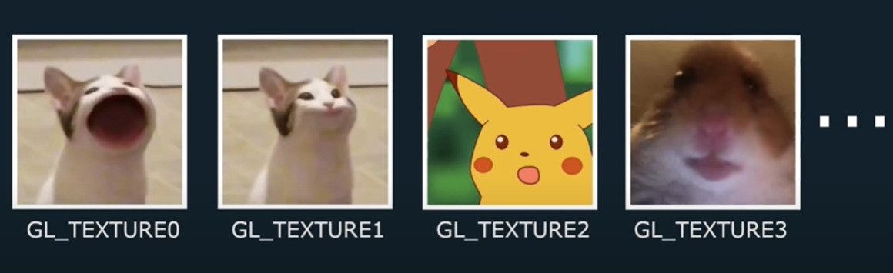
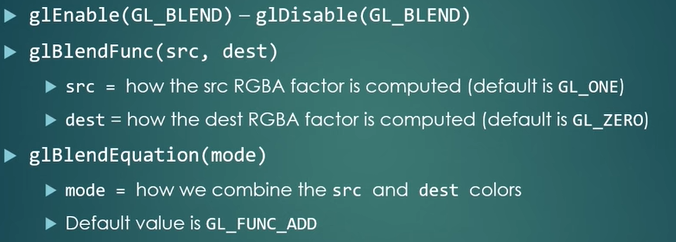
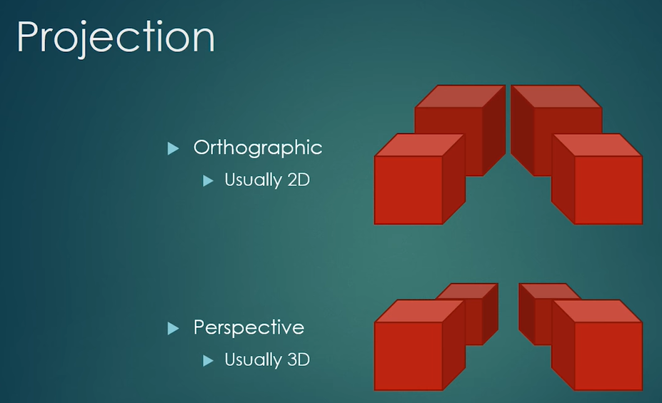
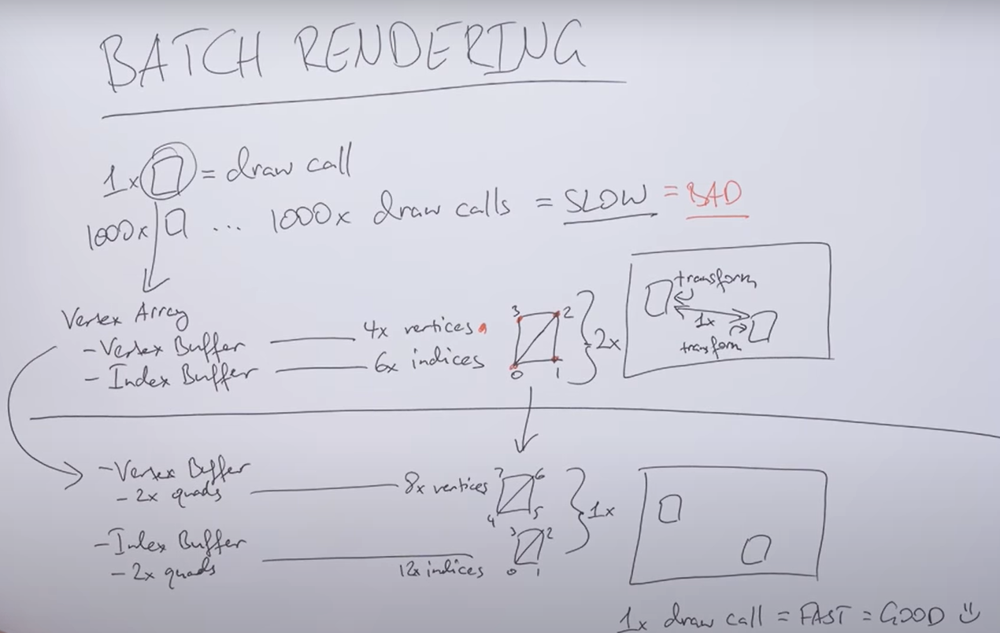

## What is OpenGL

- OpenGL is a _graphics API_ that allows us to do things with graphics, specifically it allows us to actually access our GPU(graphics processing unit) which is our graphics card which is good at drawing graphics.

- In order to actually utilize the massively powerful graphics processor that we have in either a computer or a device like a phone we need to actually use some kind of API to get access to that actual hardware and OpenGL is just one of many api's that actually allows us to access the graphics card and tell it what to do.

  - Other API like OpenGL are Vulcan, direct3d etc.

- OpenGL at its core is _just a specification_, it's kind of like a C++ specification in that regard it doesn't actually define any code or anything what it is is a specification that lists what function should exist, what parameters it take and what should it return. It's just a specification of what you can do with the API there's no implementation whatsoever.

  - The OpenGL specification specifies exactly what the result/output of each function should be and how it should perform. It is then up to the developers implementing this specification to come up with a solution of how this function should operate.

- OpenGL's implementation is actually done in the GPU driver by the GPU manufacturer. Every graphics card manufacturer gonna have their own implementations so everyone's implementation of OpenGL is gonna be slightly different which is why in a lot of cases some things may work on NVIDIA drivers on an NVIDIA GPU but that same game might look a little bit different on AMD or maybe there are bugs etc.

- Since most implementations are built by graphics card manufacturers, whenever there is a bug in the implementation this is usually solved by updating the video card drivers; those drivers include the newest versions of OpenGL that the card supports. This is one of the reasons why it's always advised to occasionally update your graphic drivers.

- All future versions of OpenGL starting from 3.3 add extra useful features to OpenGL without changing OpenGL's core mechanics; the newer versions just introduce slightly more efficient or more useful ways to accomplish the same tasks.

## Demystifying some misconceptions

- OpenGL is certainly not open source.

- OpenGL is cross platform which is it's only plus point.

  - Vulcan is also a cross platform Graphics API.
  - direct3d and metal are for windows and iOS respectively. They are native to the platform.

- Legacy OpenGL VS Modern OpenGL: The distinction between these two is shader.
  - A shader is program that runs on GPU.
  - Code in C++ or Java or C# or whatever language, it runs on CPU but since we're specifically dealing with graphics for a lot of the time we want to control what the GPU does and probably move a lot of our code from the CPU to the GPU because it's gonna run faster on the GPU so that's why shaders come in they just allow us to write code on the GPU.

## Modern OpenGL features

- A great feature of OpenGL is its support of **extensions**.
  - Whenever a graphics company comes up with a new technique or a new large optimization for rendering this is often found in an _extension implemented in the drivers_.
  - If the hardware an application runs on supports such an extension the developer can use the functionality provided by the extension for more advanced or efficient graphics. This way, a graphics developer can still use these new rendering techniques without having to wait for OpenGL to include the functionality in its future versions, simply by checking if the extension is supported by the graphics card.
- Often, when an extension is popular or very useful it eventually becomes part of future OpenGL versions.

- An **object** in OpenGL is a collection of options that represents a subset of OpenGL's state.

  - For example, we could have an object that represents the settings of the drawing window; we could then set its size, how many colors it supports and so on. One could visualize an object as a C-like struct.

  ```cpp
  // create object
  unsigned int objectId = 0;
  glGenObject(1, &objectId);
  // bind/assign object to context
  glBindObject(GL_WINDOW_TARGET, objectId);
  // set options of object currently bound to GL_WINDOW_TARGET
  glSetObjectOption(GL_WINDOW_TARGET, GL_OPTION_WINDOW_WIDTH,  800);
  glSetObjectOption(GL_WINDOW_TARGET, GL_OPTION_WINDOW_HEIGHT, 600);
  // set context target back to default
  glBindObject(GL_WINDOW_TARGET, 0);
  ```

  - **CREATE**: We first create an object and store a reference to it as an id (_the real object's data is stored behind the scenes_).
    - NOTE: Every object in OpenGL is assigned a unique id.
  - **BIND**: Next we _bind the object (using its id)_ to the target location of the context (the location of the example window object target is defined as GL_WINDOW_TARGET).
  - **OPERATE**: Next we set the window options (doing some operations on that object).
  - **UNBIND**: Finally we un-bind the object by setting the current object id of the window target to 0.
  - The options we set are stored in the object referenced by objectId and restored as soon as we bind the object back to GL_WINDOW_TARGET.

- With OpenGL creating a window, defining a context, and handling user input have to be done all by ourselves. Luckily, there are quite a few libraries out there that provide these functionalities.

## Creating a Window in OpenGL

- Creating a Window for things to place: OpenGL don't deal with creating windows, Windowing is OS specific, we use win32 API for creating a window in windows OS, now OpenGL is cross platform so we also need a way to create the window irrespective of OS.

  - For this we use some other tools like GLFW, GLUT, SDL, SFML.

- GLFW allows us to create an OpenGL context, define window parameters, and handle user input, which is the bare minimum.

## Making Modern OpenGL functions Accessible

- OpenGL functions are implemented in the GPU drivers so what one need to do now in order to use any kind of functionality is, get into those drivers pull out the functions and call them. What we actually need to do is basically just get the function declarations and then link against the functions. So we need to access the driver DLL files and just retrieve function pointers to the functions inside those libraries.
  - Now OpenGL passed 1.1 is basically modern OpenGL and there are a lot of functions so whilst we could theoretically do this manually there are a few problems with that:
    - It would not be cross-platform.
    - If there are like over a thousand functions or something like that then we need to go through all them manually and write code for that, that's gonna just be a terrible plan.
  - So what one do is use another library, there are a few libraries that actually do this like GLU, GLEW, GLAD etc.
    - Basically all it does is provides the OpenGL API specification kind of function declarations and symbol declarations and constants and all that stuff in a header file and then the CPP file on this. The actual implementation of the library identifies what graphics drivers you're using finds the appropriate DLL file and then loads all the function pointers.
  - NOTE: Don't think that these libraries implement the functions or anything they don't they just access the functions that are already on the computer in binary form.
- Be sure to include their(GLAD, GLEW, GLU) header files before windowing tool's header file(GLFW). The include file for them(GLAD, GLEW, GLU) includes the required OpenGL headers behind the scenes (like GL/gl.h) so be sure to include them(GLAD, GLEW, GLU) before other header files that require OpenGL (like GLFW).

## Double Buffer

- How we actually display an image in graphics is:
  - We clear a buffer. (glClear)
  - We draw on that buffer. (Commands to draw something)
  - Finally we display that buffer. (glFlush -> for single buffer, glSwapBuffer -> for double buffer)
- Even with animations the things remains the same as animation is just series of images rolled quickly(each still image is called a **frame** in animation).
- glClearColor function is a **state-setting function** and glClear is a **state-using function** in that it uses the current state to retrieve the clearing color from.

- When an application draws in a single buffer the resulting image may display flickering issues because the resulting output image is not drawn in an instant, but drawn pixel by pixel and usually from left to right and top to bottom. As this image is not displayed at an instant to the user while still being rendered to, the result may contain artifacts.
- To circumvent these issues, windowing applications apply a **double buffer for rendering**. The _front buffer contains the final output image that is shown at the screen_, while _all the rendering commands draw to the back buffer_. As soon as all the rendering commands are finished we swap the back buffer to the front buffer so the image can be displayed without still being rendered to, removing all the aforementioned artifacts.

## OpenGL graphics Pipeline

- Nothing is actual 3D as the screen or window is a 2D array of pixels so a large part of OpenGL's work is about transforming all 3D coordinates to 2D pixels that fit on your screen which is managed by the graphics pipeline of OpenGL.
- The graphics pipeline takes as input a set of 3D coordinates and transforms these to colored 2D pixels on your screen.
- The graphics pipeline can be divided into two large parts
  - Transforming the 3D coordinates into 2D coordinates.
  - Transforming the 2D coordinates into actual colored pixels.
- 
  - NOTE: the blue sections represent sections where we can inject our own shaders.
  - The first part of the pipeline is the _vertex shader_ that takes as input a single vertex.
    - A **vertex** is a collection of data per 3D coordinate. This vertex's data is represented using **vertex attributes** that can contain any data say position, texture coordinates, normals, colors, tangents etc.
    - The main purpose of the vertex shader is to transform 3D coordinates into different 3D coordinates and the vertex shader allows us to do some basic processing on the vertex attributes.
  - The _primitive assembly_ stage takes as input all the vertices (or vertex if GL_POINTS is chosen) from the vertex shader that form a primitive and assembles all the point(s) in the primitive shape given.
  - The output of the primitive assembly stage is passed to the geometry shader. The _geometry shader_ takes as input a collection of vertices that form a primitive and has the ability to generate other shapes by emitting new vertices to form new (or other) primitive(s).
  - The output of the geometry shader is then passed on to the _rasterization stage_ where it maps the resulting primitive(s) to the corresponding pixels on the final screen, resulting in fragments for the fragment shader to use.
    - Before the fragment shaders run, clipping is performed. Clipping discards all fragments that are outside your view, increasing performance.
    - **A fragment in OpenGL is all the data required for OpenGL to render a single pixel.**
  - The main purpose of the fragment shader is to calculate the final color of a pixel and this is usually the stage where all the advanced OpenGL effects occur.
    - Usually the fragment shader contains data about the 3D scene that it can use to calculate the final pixel color (like lights, shadows, color of the light and so on).
  - After all the corresponding color values have been determined, the final object will then pass through one more stage that is called the _alpha test and blending stage_.
    - This stage checks the corresponding depth (and stencil) value of the fragment and uses those to check if the resulting fragment is in front or behind other objects and should be discarded accordingly.
    - The stage also checks for alpha values (alpha values define the opacity of an object) and blends the objects accordingly.
    - So even if a pixel output color is calculated in the fragment shader, the final pixel color could still be something entirely different when rendering multiple triangles.

## Vertex Buffer Object (VBO)

- Vertex Buffer is just a buffer(a blob of memory) in the GPU's VRAM.
- Shadder are small programs that runs on GPU instead of CPU.
- NOTE: Sending data to the graphics card from the CPU is relatively slow, so wherever we can we try to send as much data as possible at once.
- Remember every object in OpenGL is assigned a unique id.

- OpenGL is by itself a large **state machine**: a collection of variables that define how OpenGL should currently operate. The state of OpenGL is commonly referred to as the OpenGL context. When using OpenGL, we often change its state by setting(binding) some options, manipulating some buffers and then render using the current context.

  - To draw say a triangle we need to select a buffer, a shader and tell opengl to draw a triangle using these two.
  - It's important to note that setting in OpenGL is called binding.
  - At a time opengl can only select a single buffer so the latest binded buffer is the one that is going to be affected.
  - When working in OpenGL we will come across several state-changing functions that change the context and several state-using functions that perform some operations based on the current state of OpenGL. As long as you keep in mind that OpenGL is basically one large state machine, most of its functionality will make more sense.

- A vertex is not just a position, a vertex is just a collection of data per 3D co-ordinates that can contain the position, texture coordinates, normals, colors, tangents etc.
  - NOTE: The contained data is called an attribute.

## Vertex Attributes and Layouts

- When the program (shader) actually starts to read the vertex buffer it needs to know the layout of that buffer, what is actually contained in that buffer.
- To specify the layout of our vertex buffer we use `glVertexAttribPointer` function.
  - Always remember to enable the vertex attribute.
- Each vertex attribute takes its data from memory managed by a VBO and which VBO it takes its data from (you can have multiple VBOs) is determined by the VBO currently bound to GL_ARRAY_BUFFER when calling glVertexAttribPointer.

## Shader

- Shader is just a small program that runs on our GPU.
  - We want to be able to program the GPU is because well we want to be able to tell the GPU what to do, we want to utilize the power of the GPU to actually draw graphics on the screen.
- Fragment shaders run for each fragment/pixel and they determine the color output, Vertex shaders run for each vertex and they determine the position on our screen.
  - For 90% of shader programming you're probably going to be dealing with vertex and fragment or pixel shaders.
- Like everything else in OpenGL, shaders work based on the state machine which means that when you want to use a certain shader to draw something you enable that shader.
  - You might also send some data to the shader from the CPU to the GPU.
  - We can also send data to our shader in the form of something called a _uniform_ and that comes from the CPU as well.
- **Vertex Shader**: It just take the input 3D co-ordinates and convert them into another 3D co-ordinates or pass data to fragment shader. The output of the vertex shader is gl_Position, which is a `vec4` behind the scenes. At the end of the main function, whatever we set `gl_Position` will be used as the output of the vertex shader.
  - Most of the time input data is usually not already in normalized device coordinates so we first have to transform the input data to coordinates that fall within OpenGL's visible region.
  - Vertex shader runs for each vertex passed, vertex shader is like a for each loop that runs for each vertex and output a desired 3D co-ordinates.
  - The vertex shader doesn't really want you to put things in _world space_ or in _local space_ and not even in _view space_ it wants you to say where are these vertices going to be in _clip space_ which is kind of like a normalized space from -1 to 1 inside of your your _current view_ or _render target_.
- The **fragment shader** is all about calculating the color output of your pixels.
  - Colors in computer graphics are represented as an array of 4 values: the red, green, blue and alpha (opacity) component, commonly abbreviated to RGBA.
    - When defining a color in OpenGL or GLSL we set the strength of each component to a value between `0.0` and `1.0`.
  - The fragment shader only requires one output variable and that is a vector of size 4 that defines the final color output.
  - Fragment shader runs for every _fragment_(almost same as pixel), it is like a for each loop that runs for every _fragment_ and output a desired color.
- There's only a one-way communication which means you can pass information from the vertex shader to the fragment shader but not vice versa.
- Shaders are also very isolated programs in that they're not allowed to communicate with each other; the only communication they have is via their inputs and outputs.
- A **shader program** object is the final linked version of multiple shaders combined. - To use the recently compiled shaders we have to link them to a shader program object and then activate this shader program when rendering objects. The activated shader program's shaders will be used when we issue render calls. - When linking the shaders into a program it links the outputs of each shader to the inputs of the next shader. This is also where you'll get linking errors if your outputs and inputs do not match. - Don't forget to delete the shader objects once we've linked them into the program object, we no longer need them anymore
- To work with shaders in OpenGL we follow the following steps:
  - Create a shader in GPU memory -> Fill that memory with a shader value(Copy shader from CPU to GPU) -> Compile that shader. (We do these steps with both the shaders).
  - Then we create a shaderProgram in the GPU that will run both the vertex and fragment shader, then we attach both the vertex and the fragment shader to that shader program finally we link that program.
  - Whenever we wanna use those shaders we just use that shaderProgram.(`glUseProgram`)
    

## GLSL

- Shaders always begin with a version declaration, followed by a list of input and output variables, uniforms and its main function. Each shader's entry point is at its main function where we process any input variables and output the results in its output variables.
  - Generally a shadder look like this:
    ```cpp
    #version version_number
    in type in_variable_name;
    in type in_variable_name;
    out type out_variable_name;
    uniform type uniform_name;
    void main() {
    	// process input(s) and do some weird graphics stuff ...
    	// output processed stuff to output variable
    	out_variable_name = weird_stuff_we_processed;
    }
    ```
- GLSL has most of the default basic types like: `int`, `float`, `double`, `uint` and `bool`. It also features two container types, namely `vec` and `mat` and `sampler2D` and `uniform`.
- A vector in GLSL is a 1,2,3 or 4 component container for any of the basic types. They can take the following form (`n` represents the number of components):
  - `vecn`: the default vector of `n` floats.
  - `bvecn`: a vector of `n` booleans.
  - `ivecn`: a vector of `n` integers.
  - `uvecn`: a vector of `n` unsigned integers.
  - `dvecn`: a vector of `n` double components.
- A vector in GLSL has a size between 1-4 and each of its values can be retrieved via `vec.x`, `vec.y`, `vec.z` and `vec.w` respectively where each of them represents a coordinate in space.
  - We can use `.x`, `.y`, `.z` and `.w` to access their first, second, third and fourth component respectively.
  - Note that the `vec.w` component is not used as a position in space (we're dealing with 3D, not 4D) but is used for something called **perspective division**.
  - GLSL also allows you to use `rgba` for colors or `stpq` for texture coordinates, accessing the same components.
- Vectors are a flexible datatype that we can use for all kinds of input and output.
- GLSL defined the `in` and `out` keywords to have inputs and outputs on the individual shaders.
  - Each shader can specify inputs and outputs using those keywords and wherever an output variable matches with an input variable of the next shader stage they're passed along.
  - So if we want to send data from one shader to the other we'd have to declare an output in the sending shader and a similar input in the receiving shader. OpenGL will link those variables together and then it is possible to send data between shaders (this is done when linking a program object).
- The vertex and fragment shaders differ a bit sometimes.
  - The _vertex shader_ differs in its input, each input variable is also known as a **vertex attribute** aka the layout. To define how the vertex data is organized we specify the input variables with location metadata so we can configure the vertex attributes on the CPU as `layout (location = 0)`, the location can be 1, 2 if we provide other data such as color or texture co-ordinates as well and specified it's layout in vertex attribute.
    - There is a maximum number of vertex attributes we're allowed to declare limited by the hardware. OpenGL guarantees there are always at least 16 4-component vertex attributes available, but some hardware may allow for more.
  - The _fragment shader_ requires a `vec4` color output variable, since it needs to generate a final output color. If failed to specify an output color in the fragment shader, the color buffer output for those fragments will be undefined (which usually means OpenGL will render them either black or white).
- **Uniforms** are another way to pass data from our application on the CPU to the shaders on the GPU.
  - They are global, meaning that a uniform variable is unique per shader program object, and can be accessed from any shader at any stage in the shader program.
  - Whenever we set the uniform value, they will keep their values until they're either reset or updated.
  - To declare a uniform in GLSL we simply add the `uniform` keyword to a shader with a type and a name.
    ```cpp
    	uniform vec4 ourColor; // we set this variable in the OpenGL code.
    ```
  - If you declare a uniform that isn't used anywhere in your GLSL code the compiler will silently remove the variable from the compiled version which is the cause for several frustrating errors
  - We can set the uniform value using the `glUniform4f` function.
    - Note that finding the uniform location does not require you to use the shader program first, but updating a uniform **does** require you to first use the program (by calling glUseProgram), because it sets the uniform on the currently active shader program.
  - Uniforms are a useful tool for setting attributes that may change every frame, or for interchanging data between your application and your shaders
  - NOTE: Though uniforms and vertex buffers are the way to send data from the CPU to the GPU, Uniforms are set per draw while vertex attributes are set per vertex.
  - **Fragment interpolation** happen in the fragment shader. When rendering something the rasterization stage usually results in a lot more fragments than vertices originally specified. The rasterizer then determines the positions of each of those fragments based on where they reside on the shape. Based on these positions, it interpolates all the fragment shader's input variables.
    - Say for example we have a line where the upper point has a green color and the lower point a blue color. If the fragment shader is run at a fragment that resides around a position at `70%` of the line, its resulting color input attribute would then be a linear combination of green and blue; to be more precise: `30%` blue and `70%` green.
    - Fragment interpolation is applied to all the fragment shader's input attributes.

## Index Buffer

- Everything that our GPU actually does comes down to triangles. Triangle is pretty much the smallest number of vertices we need to represent one flat kind of plane with a normal i.e. with a surface normal that is pointing in a single direction.
  - GPUs tend to kind of use triangles as their rendering kind of primitives.
- Index buffer allows us to reuse existing vertices.
- With index buffer we use `glDrawElements` instead of `glDrawArray` to draw the object.

## Vertex Array Object(VAO)

- Vertex arrays are a bit of an OpenGL special or an OpenGL original.
- They basically are a way to bind vertex buffers with a certain kind of specification for the layout of that actual vertex buffer.
- **Vertex Array Object** (VAO), remembers all of the vertex buffers that we want to use, and the memory layout(vertex attribute) of each one.
- Vertex array object is setted once per mesh. When we want to draw, all we do then is bind the VAO and draw.
- Core OpenGL **requires** that we use a VAO so it knows what to do with our vertex inputs. If we fail to bind a VAO, OpenGL will most likely refuse to draw anything.
  - The compatibility OpenGL profile makes VAO object 0 a default object. The core OpenGL profile makes VAO object 0 not an object at all.
- A vertex array object stores the following:
  - Calls to `glEnableVertexAttribArray` or `glDisableVertexAttribArray`.
  - Vertex attribute configurations via `glVertexAttribPointer`.
  - Vertex buffer objects associated with vertex attributes by calls to `glVertexAttribPointer`.
- A VAO stores the `glBindBuffer` calls when the target is `GL_ELEMENT_ARRAY_BUFFER`. This also means it stores its unbind calls so make sure you don't unbind the element array buffer before unbinding your VAO, otherwise it doesn't have an EBO configured.
- With Vertex array buffer the way that we draw things changes from being bind our shader -> bind our vertex buffer -> set up the vertex layout -> bind our indexed buffer and then actually issue the draw call, it changes from that to just being bind our shader -> then bind our vertex array -> then we bind our index buffer and then finally we we issue that draw call.
  - Basically binding the vertex buffer and setting up its layout just becomes binding the vertex array object because that contains all the state that we actually need.
  - You can actually remove the index buffer binding as well, it is also stored within the VAO.
- You basically can either have one _global VAO_ for the entire program and then bind different buffers and different vertex specifications every time or you have a _separate VAO_ for each piece of geometry or each unique piece of geometry.

## Drawing with OpenGL

- Drawing an object in OpenGL would now look something like this:
  ```cpp
  // ..:: Initialization code :: ..
  unsigned int VAO, VBO, EBO;
  // 1. bind Vertex Array Object
  glBindVertexArray(VAO);
  // 2. copy our vertices array(CPU) in a vertex buffer(GPU) for OpenGL to use
  glBindBuffer(GL_ARRAY_BUFFER, VBO);
  glBufferData(GL_ARRAY_BUFFER, sizeof(vertices), vertices, GL_STATIC_DRAW);
  // 3. copy our index array(GPU) in a element buffer(CPU) for OpenGL to use
  glBindBuffer(GL_ELEMENT_ARRAY_BUFFER, EBO);
  glBufferData(GL_ELEMENT_ARRAY_BUFFER, sizeof(indices), indices, GL_STATIC_DRAW);
  // 4. then set the vertex attributes pointers(LAYOUT)
  glVertexAttribPointer(0, 3, GL_FLOAT, GL_FALSE, 3 * sizeof(float), (void*)0);
  glEnableVertexAttribArray(0);
  // ..:: Drawing code (in render loop) :: ..
  glUseProgram(shaderProgram);
  glBindVertexArray(VAO);
  glDrawElements(GL_TRIANGLES, 6, GL_UNSIGNED_INT, 0)
  // Unbinding VAO
  glBindVertexArray(0);
  ```
- Basic overview of how things are drawn in OpenGL without vertex array buffer are a bit more complex but we can visualise it like this:
  - We bind our shader then we set up our uniforms.
  - Next we bind our vertex buffer and set up the layout of that vertex buffer and enable it.
  - Finally we bind our index buffer and then we call GL draw elements.

## Dealing with Errors in OpenGL

- We have 2 functions in OpenGL to check for errors i.e. `glGetError` and `glDebugMessageCallback`.

## Renderer

- Rendering is the act of drawing the modelled objects on screen.
- The renderer is the piece of code that take the list of properties for modelling an object and draws the actual object on the screen (or in an offscreen canvas to be composited on screen with the other objects later).
  - The renderer is like the factory where we give a bunch of data in the form of like a vertex buffer, an index buffer, a shader or whatever and the renderer make that appear in the screen.

## Textures

- A texture is a 2D image (even 1D and 3D textures exist) used to add detail to an object.
- Each vertex should have a texture coordinate associated with them that specifies what part of the texture image to sample from. Fragment interpolation then does the rest for the other fragments.
  - Texture pixel is also known as _texel_.
- Apart from images, Textures can also be used to store a large collection of arbitrary data to send to the shaders.
- Retrieving the texture color using texture coordinates is called **sampling**.
  - Texture sampling has a loose interpretation and can be done in many different ways. It is thus our job to tell OpenGL how it should _sample_ its textures.
- Co-ordinate axis for texture is s,t,r i.e. equivalent to x,y,z.
- To control how textures are wrapped on models, models define texture coordinates for their geometry that tells OpenGL which part of the texture should go on which part of the geometry. The texture's coordinates always range from 0 to 1.0 with (0, 0) at the bottom left.

  - This two value, 0 to 1.0 system gives the geometry an easy way to reference the area of the image they want applied to their surface.
  - Modeling software calls the process of wrapping geometry in textures S-T mapping.
  - Another OpenGL feature of textures is setting the wrap mode. The wrap mode defines how a texture behaves when it is given texture coordinates outside the range of 0 to 1.

- Texture coordinates do not depend on resolution but can be any floating point value, thus OpenGL has to figure out which texture pixel (also known as a texel ) to map the texture coordinate to. This becomes especially important if you have a very large object and a low resolution texture. OpenGL has options for this texture filtering as well.
  - **Texture filtering** can be set for magnifying and minifying operations (when scaling up or downwards) so you could for example use nearest neighbor filtering when textures are scaled downwards and linear filtering for upscaled textures.
- **Mipmaps** is a collection of texture images where each subsequent texture is twice as small compared to the previous one.
  - After a certain distance threshold from the viewer, OpenGL will use a different mipmap texture that best suits the distance to the object. Because the object is far away, the smaller resolution will not be noticeable to the user. OpenGL is then able to sample the correct texels, and there's less cache memory involved when sampling that part of the mipmaps.
- Loading files of different formats can be a hectic task so for that we use some sort of libraries. With C++ as the language we can read and write images using **stb_image** library.
  - We use stb_image to actually load the texture image, so we give it a file path and it will basically give us a pointer to a buffer of RGBA pixels.
  - We then take that pixel array and upload it to the GPU using OpenGL because it is our graphics specification so we use OpenGL to send that data into the GPU as a texture.
  - Finally we can modify our shaders to actually read that texture when it's drawing so the pixel shader(the fragment shader) is going to read from that texture memory and actually work out which pixel should be which color as per that texture.
    
- We load our image -> we create a texture in OpenGL -> we then have to bind that texture when it's time to render -> we modify our shader to work on the bounded texture -> we also sample that texture in our shader -> finally when we draw an object we should see that texture.
- We assign the texture to a Texture Unit. One can think of texture units as slots for textures that come together as a bundle. These generally hold about 16 textures, and allow the fragment shader to work with all 16 textures at the same time. To insert our texture in the slot of a Texture Unit, we simply need to activate that Texture.
  
- Blending is essentially how we render something that is partially or fully transparent.
  - Blending determines how we actually combine our output color(color we output from our fragment shader) with what is already in our target buffer(the buffer our fragment shader is drawing to).
  - Blending in OpenGL by default is disabled so we enable it in 3 steps:
    

## Debug UI or Real Time Rendering

- When working with computer grahics we need to constantly tweek and sometimes debug to get the desired result we want and for that we can't just switch between the code and re-compile everytime so we want someting in the application that can help us.
  - We can use a library called imGUI for that.

## Maths and Transformation

- Maths in graphics programming revolves around Matrices and Vectors.
  - Matrix is essentially an array of numbers that we can manipulate by multiplying or we can set up in various ways those calculations can be useful for things like positioning objects in a 3d world.
  - There are two types of vectors that we deal with in graphics programming -> directional vectors and positional vectors.
    - Vector is seen as like a direction and magnitude or a length.
- Creating Matrices and Vectors from scratch may be a hectic task so one can use some maths library for that like GLM (OpenGL Mathematics).
  - NOTE: In OpenGL multidimentional arrays are in column-major order.
- A projection matrix is a way for us to actually tell our window how we want to map all of our different vertices to it.
  - It just convert all of the object's positions that we have into something called normalized device coordinates which is basically some kind of normalized space that we can then map to our window.
    - A normalized space is literally a coordinate system between -1 and 1. The window(does not matter resolution, size of window) let's just say we render in full-screen so the left side will be -1, the right side will be 1, the bottom will be -1 and the top will be 1.
    - We have our computer monitor and we have our window open where we're actually rendering all of our graphics and that is between -1 and 1. However what we usually have is like a 3d world or maybe a 2d object somewhere on our screen and we need to convert it into that space that's what a projection matrix does. But at the end of the day every single vertex position of all of the objects gets mapped into a space that is between -1 and 1.
  - Orthographic and prespective projection are the two major projection.
    
- MVP(Model View Projection Matrix): The model, view and projection matrices are three separate matrices. Model maps from an object's local coordinate space into world space, view from world space to camera space, projection from camera to clip space.
  - The view matrix is supposedly supposed to represent our camera's transform(translation, rotation and scale) and the model matrix is supposed to represent our object's transform(translation, rotation and scale).
  - We multiply all the 3 matrices together and then multiply that resulting matrix with our vertex position (the vertex position of our geometry which is stored inside our vertex buffer) and that transforms that vertex into where it should be on our actual screen.
    - In OpenGL the multiplication happen PxVxM because it's column major but in direct3D which is row-major it's MxVxP.

## Multiple Rendering

- To draw same objects on different positions on the screen.

  - Doing this require different vertex positions which mean having an additional vertex buffer because we would need to create a second vertex buffer which contains all the positions of the second instance of that same object and then we could use that to actually draw them somewhere else.
  - We could also do it by changing the _Model View projection matrix uniform_, basically a matrix that had a different transformation applied like a different model matrix essentially which position our second object somewhere else in the scene. When that got multiplied with that existing kind of vertex attributes(multiplication happen in vertex shader) that we have. So those existing positions it would put them somewhere else in the screen.
    - This is a better way if we want to draw the same type of object with different/same transforms.
    - But if the count of objects increases then doing this kind of thing in a loop is not a good idea then we need to switch to something called batch rendering.

- To draw different objects on different positions on the screen require issuing different draw calls with their own data or we can use batch rendering.

## Batch Rendering

- Every game engine needs to generate data using the Central Processing Unit (CPU) on your motherboard, and then transfer this data over to the Graphics Processing Unit (GPU) on your video card so that it can render things to the screen.
- When rendering different data objects, it is best to organize the data in groups so that you minimize the number of calls from the CPU to the GPU. You also want to minimize the number of state changes which can kill your game's performance. The group that holds the data to be rendered is called a batch.
- Batching is the act of grouping tasks together, so you do them all at once, instead of switching between tasks that take place in different programs or areas.
  - How we can batch geometry together or how we can render more than one piece of geometry in a single draw call is what batching and batch rendering mean.
  - Batching means we batch together all of the geometry into a single vertex buffer and index buffer and then simply draw that once.
    
- Remember batch rendering don't promise drawing everything in a single draw call it's just a way to reduce the excessive amount of draw calls that helps in performance.
