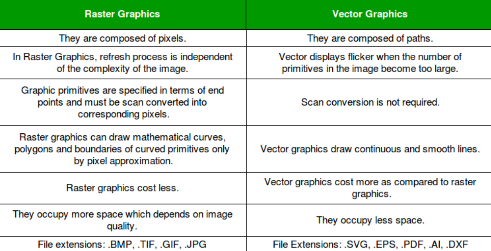

## Introduction to CG

- Computer Graphics refers to anything involved in the creation or manipulation of images on a computer, including animated images.
- Raster VS Vector graphics
  - Raster graphics are composed of pixels.
  - Vector graphics are composed of paths/shapes.
    
- Vector graphics represent an image as a list of the geometric shapes that it contains. The shapes can also have attributes, such as the thickness of a line or the color that fills a shape etc.
- More rich and detailed images uses Raster graphics.
- A **pixel** is the smallest addressable element of a picture represented on a screen, a physical point in a picture.
- An image that is presented on the computer screen is made up of collection of pixels referred as _bitmap_.
  - In CG, a bitmap is a mapping from some domain (eg. a range of integers) to bits values(0/1). It is also called a _bit array_ or _bitmap index_.
    - The more general term **pixmap** refers to a map of pixels, where each pixel may store more than two colors, thus using more than one bit per pixel.
    - In some contexts, the term bitmap implies one bit per pixel, while pixmap is used for images with multiple bits per pixel.
  - The _screen_ consists of a rectangular grid of pixels, arranged in rows and columns.
    - _Resolution of a screen_ is just the number of pixels in WxH.
    - _Aspect ratio of the screen_ is the ratio of (number of pixels in width / number of pixels in height).
  - At a given time, each pixel can show only one color.
    - The color of the pixel can be determined using different formats(color space) like RGB, RGBA, Grayscale, Indexed color etc.
- The color values for all the pixels on the screen are stored in a large block of memory known as a **frame buffer**.
  - Changing the image on the screen requires changing color values that are stored in the frame buffer.
-
