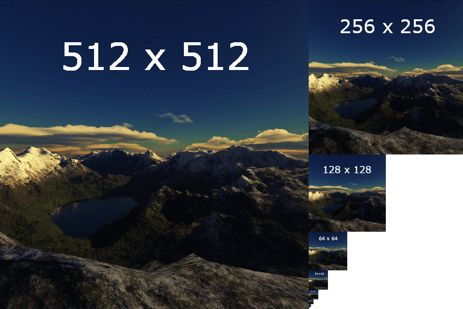
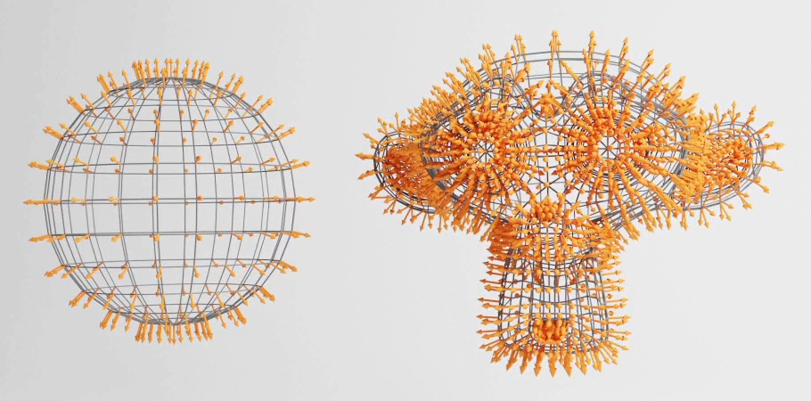

## What is WebGL

- WebGL enables web content to use an API based on OpenGL ES 2.0 to perform 2D and 3D rendering in an HTML canvas in browsers that support it without the use of plug-ins.

  - A JS API.
  - Result can be drawn in <canvas>
  - Compatible with most modern browsers

- WebGL programs consist of control code written in JavaScript and shader code (GLSL) that is executed on a computer's Graphics Processing Unit (GPU).

  - It uses the GPU and so is able to do things with graphics super fast.
    - The CPU can do calculations really fast but one by one, GPU on the other hand is a bit slower but can do things in parallel.

- To draw a 3D model we need to draw a lot of triangles and colorize them so they look how we want them to look.

  - The GPU will position all those points at once according to many factors.
  - Once the points are placed the GPU will then draw all visible pixels of those triangles, which will be calculated and drawn in parallel and very fast.
  - The instructions to place the points and draw the pixels are written shaders.
    - Shaders are just programs that will run on GPU.

- Native WebGL benefits from existing at low level which enables optimizations and more control.

- There are lots of frameworks available that encapsulate WebGL's capabilities, making it easier to build 3D applications and games. Eg. THREE.js, BABYLON.js etc.
  - Three.js is a 3D JavaScript library that enables developers to create 3D experiences for the web. It works with WebGL, but you can make it work with SVG and CSS as well.
    - It supports different forms of three-dimensional in-browser rendering including CSS3D and WebGL.
  - Three.js is just above WebGL.
  - We can still interact with WebGL and create our own shaders.
  - It's the most popular WebGL library and quite close enough to native WebGL.

## Understanding Three.js

- Three.js works on the basis of scenes and objects. In order to render (show) an object, it must first be added to a scene. As a collection of objects, a scene is then paired with a camera (a view into a scene) and usually animated.
- Three.js prefers a three-step series of functions.
  - The first is an initialization of the settings for the project.
  - The second is usually an animation or updating loop.
  - The third is usually updating, rendering loop, which connects into the second.
- The first, initialization loop usually runs one time with the animating and rendering loops running infinitely as long as the project continues to be shown to users.

## Basic Terminologies

- **Scene** is a container where we put our actors, lights, camera etc and which will later be rendered on the screen.
- **Objects** can be many things. You can have primitive geometries, imported models, particles, lights, mesh and so on.
  - **Mesh** is a combination of geometry(shape) and material(looks).
  - NOTE: Once a mesh is created always remember to add it in the scene.
- **Camera** serves as a point of view when doing a render, one can have multiple cameras but only one can render at a time and can switch between them. They are not visible.
  - **FOV** is the extent of the scene that is seen on the display at any given moment. The value is in degrees. Field of view is the verticle vision angle.
  - **Aspect ratio** is w/h of the renderer.
  - **near and far clipping plane** means that objects further away from the camera than the value of far or closer than near won't be rendered.
- **Renderer** will take a scene and a camera and then render the scene from camera point of view. The results are drawn in canvas.
- A scene is created, Objects are then added to the scene. And then, when paired with a camera, scene can be rendered (shown) and animated/updated (refreshed).

## Using a bundler for Three.js

- A bundler is a tool that bundle up the entire project in one file with further modifications.

## Transformation

- All the transformation properties are compiled in matrices.
  - Matrices are used internally by Three.js, by the WebGL, by OpenGL and by the GPU to transform things.
- Major Transformation properties are:
  - position
  - scale
  - rotate
  - quaternion
- All classes that inherit from the `Object3D` class possess those properties like `PerspectiveCamera` or `Mesh` etc.
- `Object3D` instances have an excellent method named `lookAt(...)` that lets you ask an object to look at something.
- At some point, you might want to group things. You can do that with the `Group` class. Instantiate a `Group` and add it to the scene. Now, when you want to create a new object, you can add it to the Group you just created using the `add(...)` method rather than adding it directly to the scene because the `Group` class inherits from the `Object3D` class, it has access to the Previously-mentioned properties and methods like `position`, `scale`, `rotation`, `quaternion`, and `lookAt`.
  - `Group` is also like a mesh that is not primitive like a data type created from `class` or `struct` or `union` etc.

## Animation in 3js

- Animation is like stop motion(move stuffs take a pic, move them again take a pic again and so on).
- The number of images/frames shown per second is called fps. The more the fps the smoother the animation.
- For animations we create a function that will handle the animation and then we call it.
  - The functions that handles the animation just update the object, render the scene on screen and then somehow calls itself in the next frame(here using `window.requestAnimationFrame`).
  - `window.requestAnimationFrame` will take a function and then call that function in the next frame.
- Now people use a library called GSAP(Green soak animation platform), so now the animation function just render the scene on screen and calls itself in the next scene, the updation of the object is done using gsap.
  - GSAP has a built-in requestAnimationFrame, so you don't need to update the animation by yourself, but still, if you want to see the cube moving, you need to keep doing the renders of your scene on each frame.

## Camera

- There are a few different cameras in three.js.
- Camera is an abstract class, so it can't be used directly.
  - OrthographicCamera
  - PrespectiveCamera
  - ArrayCamera
  - StereoCamera
  - CubeCamera

## Controls

- Inside of the library itself, there are no control schemes nor ways of moving objects via user input. However, inside the collection of examples are few ways to approach this problem.
- **Controls** are available in three.js's collection of example and are used extensively to control things based on different situations. These are just like event listeners that listens for clicks, device's rotation etc.
  - Orbit Controls
  - Device Orientation Controls
  - Fly Control
  - First Person Control
  - Pointer Lock Control
  - Trackball Control
  - Transform Control
  - Drag Control
- Controls provide us with some functionality like rotation with mouse drag and stuffs like that but if we want we can implement those things on our own as well using vanilla JS.
- Controls are handy but they have their limitations, if one want to use them just make sure they support all the features one need otherwise do things customly.

## Fullscreen and Resizing

- A full screen can be achieved if we just set the sizes according to the browser window, using the DOM and some basic CSS.

  - The whole area that display things for us is the _screen_, The browser's area is the _window_, and the area of the canvas that display the WebGL content is the _viewport_.
  - To get the real full screen we can use `canvas.requestFullScreen` (DOM) and to exit full screen we can use `document.exitFullscreen()` (DOM).

- For resizing we need to listen to the resize using DOM. On recieving the change just update the size of viewport to current window size.
  - Just resizing won't be enough we need to update the camera and renderer's size as well.
- **Pixel Ratio**: The pixel ratio is the ratio between physical pixels and logical pixels. How many physical pixels one can have on the screen for one pixel unit on software part.
  - High pixel ratio means more stress on GPU which is not a good thing.

## Geometry in Three.js

- A geometry is composed of vertices(point co-ordinates in 3D space with some data) and faces(triangle that join these vertices to create a surface).
- Geometry can be used to create meshes as well as particles.
- NOTE: A Vertex can store more data than positions like UV co-ordinates, normals, colors, texture co-ordinates etc.
- Some common Geometry in Three.js are
  - BoxGeometry
  - PlaneGeometry
  - CircleGeometry
  - ConeGeometry
  - CylinderGeometry
  - TorusGeometry
  - TorusKnotGeometry
  - SphereGeometry
  - TextGeometry
- One can also create their custom geometry using `Geometry` class in Three.js.
  - A single point in 3D space can be created using Vector3 in Three.js.
  - A face in 3D space can be created using Face3 in Three.js.
    - A Face3 will use the vertices array of the geometry in which it is pushed to create faces.
  - Both the point(Vector3) and faces(Face3) can be pushed in a geometry(Geometry) and be used accordingly.
- **Buffer Geometry** are more efficient and optimised but less developer friendly so it's a lot of code when we try to create a custom buffer geometry.
  - Almost all Geometry have a buffer version.
  - When working with `BufferGeometry`, we store the values in an Array(Float32Array), then convert that array into `BufferAttribute` and finally set it as BufferGeometry's attribute.
  - Here we don't need to create faces explicitly.
  - Some Geometry's faces can share common vertices, so when creating a buffer geometry we can specify a bunch of vertices and then the indices to create the faces and re-use vertices multiple times.

## Debug UI

- When working with computer grahics we need to constantly tweek and sometimes debug to get the desired result we want and for that we can't just switch between the code and browser so we want someting in the browser that can help us.
  - We can do that using a basic html input tag and then link it using js.
  - We can also use some cool libraries like dat.GUI, control-panel, ControlKit, Guify, Oui etc.

## Textures

- Textures are images that cover the surface of the geometries. Many types of textures can have different effects on the appearance of your geometry. It’s not just about the color.
  - _Color_ (Albedo) is a simple color applied on geometry.
  - _Alpha_ Texture is a grayscale image where white is visible and black is not visible.
  - _Height_(Displacement) Texture is also a grayscale image which moves the vertices to create some reliefs.
    - For this one need good amount of vertices so enough subdivision is needed.
  - _Normal_ Texture adds details, but the vertices won't move so it doesn't need subdivision instead it just lures the light about the face orientation.
    - It provides better performance than adding a Height Texture.
  - _Ambient Occlusion_ is again a grayscale image, it adds fake shadows in crevices which is not accurate but help us create contrast.
  - _Metalness_ is also a grayscale image where white means metallic and black means non-metallic.
    - It's mostly used for reflection.
  - _Roughness_ is also a grayscale image where white means rough and black means smooth.
    - It's mostly used for light dissipation.
- A `texture loader` can be used to load multiple textures in a three.js app.
- PBR(Physically based rendering) principles are the technics that tends to follow real-life directions to get realistic results.
  - While there are many other techniques, PBR is becoming the standard for realistic renders, and many software, engines, and libraries are using it.
- A UV map is the flat representation of the surface of a 3D model used to easily wrap textures. The process of creating a UV map is called **UV unwrapping**.
  - The texture is being squeezed or streached in different ways to cover the geometry.
  - Each vertex will have a 2D co-ordinate on a flat plane(UV map).
- With textures on the mesh we can repeat the texture, set some offset value for the texture, do transformation on texture(Rotate, Translate, Scale) etc.
- There is no such thing as a 3D texture, as they’re always based on a 2D image. This is where UV mapping comes in, as it is the process of translating your 3D mesh into 2D information so that a 2D texture can be wrapped around it.

- **Mipmapping** is a technique that consists of creating half a smaller version of the texture again and again until we get a 1x1 texture.
  - All the texture variants are send to GPU and the GPU selects the most appropriate version of the texture.
  - Mipmapping increase the number of pixels.
  - It is used in 3D scenes to decrease the time required to render a scene.
  - It is a technique where a high-resolution texture is downscaled and filtered so that each subsequent mip level is a quarter of the area of the previous level.
    
  - Three.js and the GPU already handle all of this, and you can just set what filter algorithm to use. There are two types of filter algorithms: the minification filter and the magnification filter.
  - _Minification filter_ happens when the pixels of texture are smaller than the pixels of the render i.e. the texture is too big for the surface it covers.
  - _Magnification filter_ happens when the pixels of texture are bigger than the pixels of the render i.e. the texture is too small for the surface it covers.
- When creating textures keep the weight, the data and the size(resolution) in your mind.
  - The user will have to download the texture so we should keep them light like image compression.
  - Each pixel of the texure will have to be stored in the GPU, so the size of image should be less.
  - Mipmapping will produce half the smaller version of textures repeatedly until 1x1 so the texture width and height must be power of 2.

## Materials

- Materials are used to put color on each visible pixel of a geometry. The algorithm of which is written in shaders(fragment shader).
- Materials in three.js are
  - MeshBasicMaterial
  - MeshNormalMaterial
  - MeshMatcapMaterial
  - MeshDepthMaterial
  - MeshLambertMaterial
  - MeshPhongMaterial
  - MeshToonMaterial
  - MeshStandardMaterial (requires light source)
  - MeshPhysicalMaterial
  - PointsMaterial (For particales)
- Normals are information that contains the direction of the outside of the face. They can be used for lightning, reflection, refraction etc.
  
- MeshStandardMaterial uses PBR.
- ShaderMaterial and RawShaderMaterial can be used to create custom materials.
- Environment Map is an image of what's surrounding the scene. It can be used for reflection and refraction but also for general lighting.

## 3D Text

- A `font loader` can be used to load multiple fonts in a three.js app.
- A text can be created either by `TextGeometry` or `TextBufferGeometry`.
- Fonts in three.js should be typeface.
- **Bounding** is an information associated with the geometry that tells what space is taken by the geometry. It can be a box or a sphere.
  - This help three.js calculate if the object is on the screen or not(**frustum culling**).
  - The view frustum is the region of space in the modeled world that may appear on the screen; it is the field of view of a perspective virtual camera system.

## Light

- Adding lights in three.js is as simple as adding a mesh, just instantiate the right class and add it to the scene.
- Types of lights
  - **Ambient light** applies _omnidirectional lighting_ where we define only color and intensity. Every part of the mesh is going to lit with exact same intensity regardless of it's position and direction.
    - It's a general level of illumination that does not come directly from a light source
    - It's used to simulate light bouncing effect. It consists of light that has been reflected and re-reflected so many times that it is no longer coming from any particular direction.
  - **Directional light** will have a sun like effect as if sun rays were travelling in parallel.
    - It's like light source is at an infinite distance from the scene.
  - **Hemisphere light** is like directional light right above the scene but with different color from the sky than from the one coming form the ground.
    - This can't be used to create shadows.
  - **Point light** is like a pocket lighter. They starts at infinitely small point and spreads uniformly in all directions.
    - These are used to add lighting within a room or to enhance the lighting within a spherical object. These shine light in all directions
    - Unlike a directional light, these can be moved around and rotated to shine light in a specific direction.
  - **Rect Area light** is like a big rectangular plane light available on the photoshoot set. It's a mix between directional and diffuse light.
    - This only works with `MeshStandardMaterial` and `MeshPhysicalMaterial`.
  - **Spot light** is like a flashlight. It's a cone of light starting at a point and oriented in a direction.
- Lights are great and can be realistic if well used. The problem is that lights can cost a lot when it comes to performance. The GPU will have to do many calculations like the distance from the face to the light, how much that face is facing the light, if the face is in the spot light cone, etc.So try to add as few lights as possible and try to use the lights that cost less.
  - Minimal cost: AmbientLight, HemisphereLight.
  - Moderate cost: DirectionalLight, PointLight.
  - High cost: SpotLight, RectAreaLight.
- _Baking_ is a general term for embedding pre-computed information into an asset for the purposes of optimizing the rendering of that asset.
  - There is texture/map baking, animation/simulation baking, light baking.
  - For our case the idea is that you bake the light into the texture. Unfortunately, you won’t be able to move the lights, because there are none and you’ll probably need a lot of textures.
- To assist us with positioning of the lights, three.js provided us with helpers. They help us see how certain light source are projecting light to our scene.
  - Hemisphere light helper
  - Directional light helper
  - Point light helper
  - Rect Area light helper
  - Spot light helper

## Shadows

- Dark part in the back of an object is called _core shadow_ but the hard part is _drop shadow_.
  - The back of the objects are indeed in the dark, and this is called the core shadow.
  - Drop shadow is where objects create shadows on the other objects.
- Shadows in three.js
  - When you do one render, Three.js will first do a render for each light(supporting shadows) supposed to cast shadows.
  - Those renders will simulate what the light sees as if it was a camera. During these lights renders, `MeshDepthMaterial` replaces all meshes materials.
  - The results are stored as textures and named shadow maps. You won’t see those shadow maps directly, but they are used on every material supposed to receive shadows and projected on the geometry.
- Only the following types of lights support shadows:
  - PointLight (Prespective Camera in every 6 direction(front, back, up, down, left, right))
  - DirectionalLight (Orthographic Camera)
  - SpotLight (Prespective Camera)
  - NOTE: As these lights cast shadows and three.js use camera for shadow then all these lights will have a shadow's camera property
- Shadow map Optimization
  - Render Size: Three.js is doing renders using shadow maps for each light. We can access this shadow map (and many other things) using the shadow property on the light. By default, the shadow map size is only 512x512 for performance reasons. We can improve it but keep in mind that you need a power of 2 value for the mipmapping.
  - Near and Far: Three.js is using cameras to do the shadow maps renders. Those cameras have the same properties as the cameras we already used. This means that we must define a near and a far . It won’t really improve the shadow’s quality, but it might fix bugs where you can’t see the shadow or where the shadow appears suddenly cropped.
  - Amplitude: Three.js is using cameras to do the shadow maps renders. We can control how far on each side the camera can see with the top , right , bottom , and left properties with orthographic camera and with fov with prespective camera. The smaller the values, the more precise the shadow will be. But if it’s too small, the shadows will just be cropped.
- Shadow Map Algorithms: Different types of algorithms can be applied to shadow maps:
  - `THREE.BasicShadowMap` Very performant but lousy quality
  - `THREE.PCFShadowMap` Less performant but smoother edges(default)
  - `THREE.PCFSoftShadowMap` Less performant but even softer edges
  - `THREE.VSMShadowMap` Less performant, more constraints, can have unexpected results
- Atlernatives of Creating Shadows
  - Baking Shadows: Three.js shadows can be very useful if the scene is simple, but it might otherwise become messy. A good alternative is baked shadows. Shadows are integrated into textures that we apply on materials. Unfortunately it's not dynamic.
  - A less realistic but more dynamic solution would be to use a more simple shadow under the mesh and slightly above the plane. The texture is a simple halo. The white part will be visible and the black part will be invisible. Then, we move that shadow with the mesh.
    - We will create a plane and use the shadow texture on that plane then we group that plane and the mesh so it's like a dynamic shadow. As the mesh move the shadow move too.
- Finding the right solution to handle shadows is up to you. It depends on the project, the performances and the techniques you know. You can also combine them.

## Particles

- Particles are very popular and can be used to achieve various effects such as stars, smoke, rain, dust, fire, and many other things.
- The good thing with particles is that you can have hundreds of thousands of them on screen with a reasonable frame rate. The downside is that each particle is composed of a plane (two triangles) always facing the camera.
- Creating particles is as simple as making a Mesh. We need a geometry (ideally a BufferGeometry), a material that can handle particles (`PointsMaterial`), and instead of producing a Mesh we need to create a `Points`.
  - Points is a 3js class that handles particles.
  - 1 `Points` is basically 1 particle which is basically composed of a plane (two triangles) always facing the camera.
  - The geometry is basically how and where all the particles will be placed say if we take a sphere then all the particles will be placed at the vertex of sphere.
    - We often tend to use a custom geometry for that. To create a custom geometry, we can start from a `BufferGeometry`, and add a position attribute as new `BufferAttribute`.
- We can now give the point(particle) some color or texture(map or alphaMap).
  - When working with alphaMap we have to keep the transparency property as true, but we can still randomly see some edges of the particles. That is because the particles are drawn in the same order as they are created, and WebGL doesn't really know which one is in front of the other. There are multiple ways of fixing this.
    - Alpha Test: The `alphaTest` is a value between 0 and 1 that enables the WebGL to know when not to render the pixel according to that pixel's transparency. By default, the value is 0 meaning that the pixel will be rendered anyway. If we use a small value such as 0.001, the pixel won't be rendered if the alpha is 0.
    - Depth Test: When drawing, the WebGL tests if what's being drawn is closer than what's already drawn. That is called depth testing. Deactivating depth test can thus help us. Deactivating it is just like telling WebGL to not care about what particle is in front and what is at back and just draw everything. While this solution seems to completely fix our problem, deactivating the depth testing might create bugs if you have other objects in your scene or particles with different colors. The particles might be drawn as if they were above the rest of the scene.
    - Depth Write: WebGL test if what's being drawn is closer than what's already drawn. The depth of what's being drawn is stored in something we call a `depth buffer`. Instead of not testing if the particle is closer than what's in this depth buffer, we can tell the WebGL not to write particles in that depth buffer. Sometimes, other objects might be drawn behind or in front of the particles depending on many factors like the transparency, in which order you added the objects to your scene, etc.
  - There is no perfect solution. We have to adapt and find the best combination according to the project.
- Blending: WebGL draws the pixels one on top of the other. By changing the blending property, we can tell the WebGL not only to draw the pixel, but also to add the color of that pixel to the color of the pixel already drawn. That will have a saturation effect that can look amazing. We can do that using the `blending` property.
- To update these millions of particles on each frame with a good framerate, we need to create our own material with our own custom shaders.

## Raycaster

- Raycaster cast (or shoot) a ray in a specific direction and test what objects intersect with it.
  - We use that technique to detect if there is a wall in front of the player, test if the laser gun hit something, test if something is currently under the cursor to simulate mouse events, and many other things.
- Three.js has a `Raycaster` class in it that help us to do these things.
  - We basically set the raycaster at a point(Vector3), pointing to a certain direction(Normalised Vector3).
  - Then we can have it shoot rays and tell us about intersection using `intersectObject` to test one object or `intersectObjects`to test an array of objects.
  - Raycater can also be set at the camera using `setFromCamera`.

## Shaders

- Small program that runs on GPU.
- In three.js shaders are written in GLSL as three.js is an abstraction over WebGL which is an abstraction over OpenGL.
  - We send a lot of data to the shader such as the vertices coordinates, the mesh transformation, information about the camera and its field of view, parameters like the color, the textures, the lights, the fog, etc. The GPU then processes all of this data following the shader instructions, and our geometry appears in the render.
- In three.js major 2 types of shaders are vertex and fragment shader.
  - Vertex shader takes in data like vertices coordinates, mesh transformations, camera informations etc and it position the vertices on the render accordingly.
    - Vertex shader will run for every vertices.
    - The input data it will take is called `attributes` which is taken from geometry's atrributes property.
      - Attributes are information that differ between each vertices and can only be used in vertex shader.
  - Fragment Shader runs for every fragment(pixel) of the render and is used to assign color/texture to the fragment/pixel.
    - Fragment shader can also recieve data/values from vertex shader called `varying`.
    - For fragments whose data is not provided, fragment interpolation get them their color/texture.
    - Varying are interpolated between vertices.
  - Some global inputs (data) which is same for every vertices is called `uniforms`.
    - uniforms are values that doesn't change between vertices/fragments and can be used by both vertex and fragment shader.
  - Vertex Shader can use attribute and unfiroms and fragment shader can use uniforms and varying.
- We can write our shader and use them in three.js using `ShaderMaterial` and `RawShaderMaterial`.
  - These shader classes take vertex and fragment shader as parameter and provide the required material to the mesh.
- GLSL has most of the default basic types like: `int`, `float`, `double`, `uint` and `bool`. It also features two container types, namely `vec` and `mat` and `sampler2D` and `uniform`. We can also create our own functions in GLSL.
- A vector in GLSL is a 1,2,3 or 4 component container for any of the basic types. They can take the following form (`n` represents the number of components):
  - `vecn`: the default vector of `n` floats.
  - `bvecn`: a vector of `n` booleans.
  - `ivecn`: a vector of `n` integers.
  - `uvecn`: a vector of `n` unsigned integers.
  - `dvecn`: a vector of `n` double components.
- A vector in GLSL has a size between 1-4 and each of its values can be retrieved via `vec.x`, `vec.y`, `vec.z` and `vec.w` respectively where each of them represents a coordinate in space.
  - We can use `.x`, `.y`, `.z` and `.w` to access their first, second, third and fourth component respectively.
  - Note that the `vec.w` component is not used as a position in space (we're dealing with 3D, not 4D) but is used for something called **perspective division**.
  - GLSL also allows you to use `rgba` for colors or `stpq` for texture coordinates, accessing the same components.
  - With Vectors in GLSL we can do something called **swizzle**.
- Vectors are a flexible datatype that we can use for all kinds of input and output.
- If we want to send data from one shader to the other we'd have to declare a varying with same name in both of the sahders. Three.js will link those variables together and then it is possible to send data between shaders.
- The vertex and fragment shaders differ a bit sometimes.
  - The _vertex shader_ differs in its input, each input variable is also known as a ** vertex attribute** which is basically the data of the particular vertex that comes from the geometry's attribute property. These attributes include position, normals, color, or even our custom attributes.
  - The _fragment shader_ requires a `vec4` color output variable, since it needs to generate a final output color. If failed to specify an output color in the fragment shader, the color buffer output for those fragments will be undefined (which usually means OpenGL will render them either black or white).
- **Uniforms** are another way to pass data from our application on the CPU to the shaders on the GPU.
  - They are global, meaning that a uniform variable is unique per shader program object, and can be accessed from any shader at any stage in the shader program.
  - Whenever we set the uniform value, they will keep their values until they're either reset or updated.
  - To declare a uniform in GLSL we simply add the `uniform` keyword to a shader with a type and a name.
    ```cpp
    	uniform vec4 ourColor; // we set this variable in the OpenGL code.
    ```
  - If you declare a uniform that isn't used anywhere in your GLSL code the compiler will silently remove the variable from the compiled version which is the cause for several frustrating errors
  - We can set the uniform value using the `glUniform4f` function.
    - Note that finding the uniform location does not require you to use the shader program first, but updating a uniform **does** require you to first use the program (by calling glUseProgram), because it sets the uniform on the currently active shader program.
  - Uniforms are a useful tool for setting attributes that may change every frame, or for interchanging data between your application and your shaders
  - NOTE: Though uniforms and vertex buffers are the way to send data from the CPU to the GPU, Uniforms are set per draw while vertex attributes are set per vertex.
- **Fragment interpolation** happen in the fragment shader. When rendering something the rasterization stage usually results in a lot more fragments than vertices originally specified. The rasterizer then determines the positions of each of those fragments based on where they reside on the shape. Based on these positions, it interpolates all the fragment shader's input variables.
  - Say for example we have a line where the upper point has a green color and the lower point a blue color. If the fragment shader is run at a fragment that resides around a position at `70%` of the line, its resulting color input attribute would then be a linear combination of green and blue; to be more precise: `30%` blue and `70%` green.
  - Fragment interpolation is applied to all the fragment shader's input(varying).
- **Vertex Shader**: It just take the input 3D co-ordinates and convert them into another 3D co-ordinates or pass data to fragment shader. The output of the vertex shader is gl_Position, which is a `vec4` behind the scenes. At the end of the main function, whatever we set `gl_Position` will be used as the output of the vertex shader.
  - Most of the time input data is usually not already in normalized device coordinates so we first have to transform the input data to coordinates that fall within OpenGL's visible region.
  - Vertex shader runs for each vertex passed, vertex shader is like a for each loop that runs for each vertex and output a desired 3D co-ordinates.
  - The vertex shader doesn't really want you to put things in _world space_ or in _local space_ and not even in _view space_ it wants you to say where are these vertices going to be in _clip space_ which is kind of like a normalized space from -1 to 1 inside of your your _current view_ or _render target_.
- The **fragment shader** is all about calculating the color output of your pixels.
  - Colors in computer graphics are represented as an array of 4 values: the red, green, blue and alpha (opacity) component, commonly abbreviated to RGBA.
    - When defining a color in OpenGL or GLSL we set the strength of each component to a value between `0.0` and `1.0`.
  - The fragment shader only requires one output variable and that is a vector of size 4 that defines the final color output. Just like `gl_Position` the output in fragment shader is `gl_FragColor`.
  - Fragment shader runs for every _fragment_(almost same as pixel), it is like a for each loop that runs for every _fragment_ and output a desired color.
- There's only a one-way communication which means you can pass information from the vertex shader to the fragment shader but not vice versa.
- Shaders are also very isolated programs in that they're not allowed to communicate with each other; the only communication they have is via their inputs and outputs.
- `MVP Matrix`: The model, view and projection matrices are three separate matrices. Model maps from an object's local coordinate space into world space, view from world space to camera space, projection from camera to clip space.
- GLSLify is a node module that improves what we can do with our glsl files. With glslify, we can import and export glsl codes like modules. That is good to separate our code into multiple smaller and reusable parts.

## Mixing HTML and WEBGL

- Sometimes we need an interactive HTML element that follows a specific 3D position on the scene, so it looks like they are part of the WebGL.
- Points of intrest are stored in a an array. Each point object will have two properties: the 3D position(Vector3) and a reference to the HTML element(Quering using DOM).
- We should update the points HTML elements on each frame directly in the frame update (tick) function. We need to get the 2D screen position of the 3D scene position of the point.
  - First, we need to clone the point's position.
  - To get the 2D screen position, we need to call the `project(...)` method and use the camera as parameter which will convert the 3D co-ordinates to NDC(Normalized device co-ordinates) wrt selected camera.
  - To go from that projected screen position(NDC) to the pixels on the screen, we need to multiply it by half the size of the render.
- With the desired co-ordinates we can now stick any HTML element to that co-ordinate. So our HTML element will now be glued with the point on 3D space.
- As we are dealing with 3D and the screen that render it is 2D we should keep in mind that our point won't always be in the front meaning it can also be behind something else so we also have to deal with showing and hiding the HTML element.
  - To test if something is in front of the point, we will use `Raycaster`. We'll shoot a ray from the camera to the point.
  - If there is no intersecting object, we show the point.
  - If there is something, we test the distance of the intersection. If the intersection point is further than the point, it means the object is behind the point, and we can show it.
  - If the intersection point is closer than the point, the intersecting object is in front of the point, and we hide it.
- Now we can get the 3D point on our 2D screen like we are seeing the scene in real life, we can now add anything with HTML in it but we should always wait for the scene to be ready otherwise things will get messy. We can do that using a boolean that is set to true when the scene gets ready.
- Keep in mind that combining HTML with WebGL is usually bad for performances. Avoid doing it, and if you have no other choice, keep an eye on the frame rate and regularly test on different devices.
