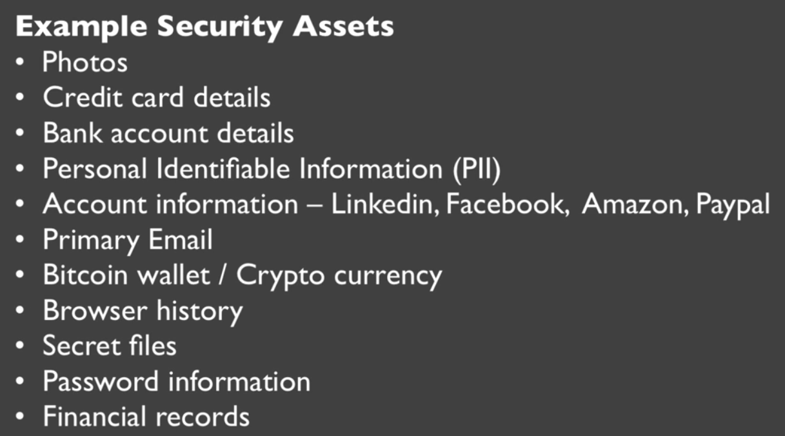
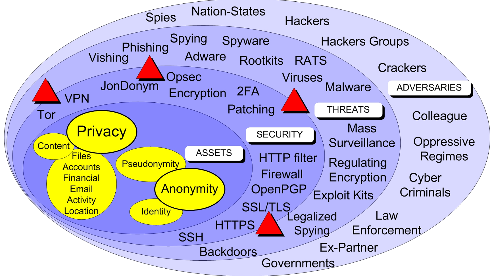
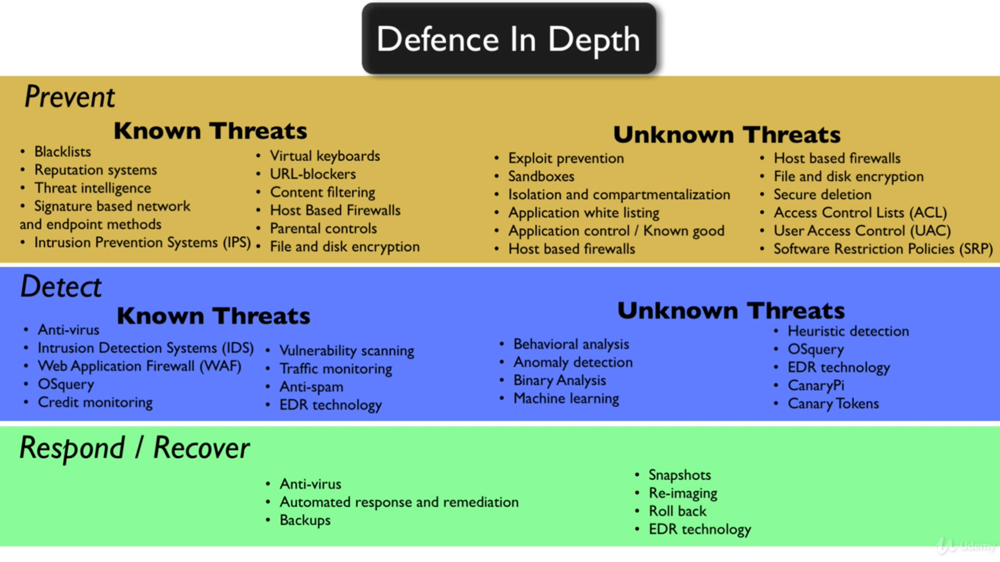

# **Security assets**

Time is valuable so we want to invest as little as our resources in security, we should do whatever we wanna do and not worry about the security.

Protect what you values most and get on with things we wanna do.

To protect something we should know what we value and how much we value that thing.

Select the Assets wisely.

# **Privacy, Anonymity and Pseudoanonymity**

**Privacy** is about maintaining confidentiality and keeping secrets.

- Privacy is when people don't know what we are doing but know who we are.

**Anonymity** is when people know what you are doing but don't know who you are.

- Anonynmity is about keeping the identity secret.

**PseudoAnonymity** is about keeping an alias name, a cover name, being anonymous but known.

Security is the degree to which our assets are resistant to threat from adversaries.

- Security controls are selected based on the type of threat and adversaries we face.
- A threat will try to exploit vulnerabilities in the security to impact the assets.
- **RISKS = (Vulnerabilities X Threats X Impact)**
- 

**Risk Assesment**: We can't have 100% security so risk assesment is what we do to implement good security controls.

> Privacy isn't about hiding something. It's about being able to control how we present ourselves to the world. It's about maintaining a public face while at the same time being permitted private thoughts and actions. It's about personal dignity. - Bruce Schneier

# **Security Attributes**

Assets are given security measures selected by risk assesment and based on the Security attributes i.e. **Confidentiality, Integrity, Availability (C-I-A Triad)**.

- Other common security attributes includes Possession, Authenticity, Utility, Non-Repudiation, Authentication, Authorization.

Defence in Depth: _Prevent->Detect->Recover_.

- The idea is _what we can't prevent we detect, what we can't detect we recover from_.
  

**Zero Trust Model**: The lesser the trust the lower the risk.

- Mitigate the risk by distributing the trust.
- Trust nothing or no-one, evaluate the risk and distribute the trust.
