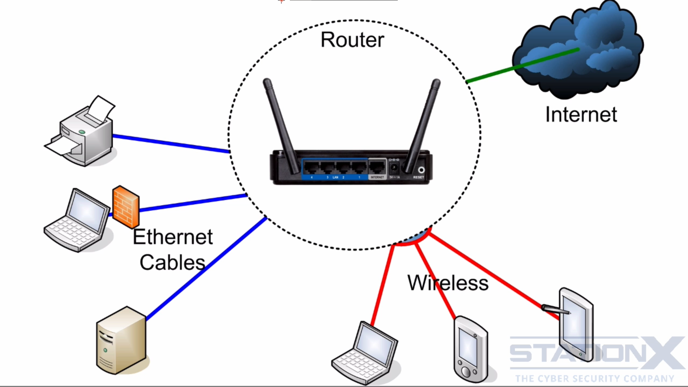
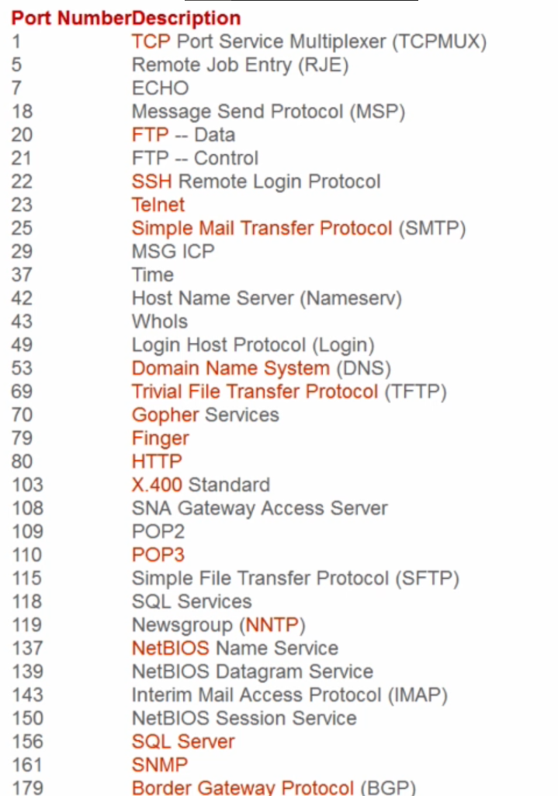

The basic setup of internet access through a router look something like this:
 - Router is the central component of both the network and the security. - Router is the default gateway for all trafic to the internet. - Default gateway is the ip address of the router.

Router will play an important role in sheilding internal devices from the internet, the router will have an external ip address that will communicate with the internet and an internal ip address that will communicate with our devices.

Port Forwarding and DMZ: Port forwarding or Port mapping is an application of network address translation that redirects a communication request from one address and port number combination to another while the packets are traversing a network gateway, such as a router or firewall.

- Ports: A port is **a virtual point where network connections start and end**.
  
