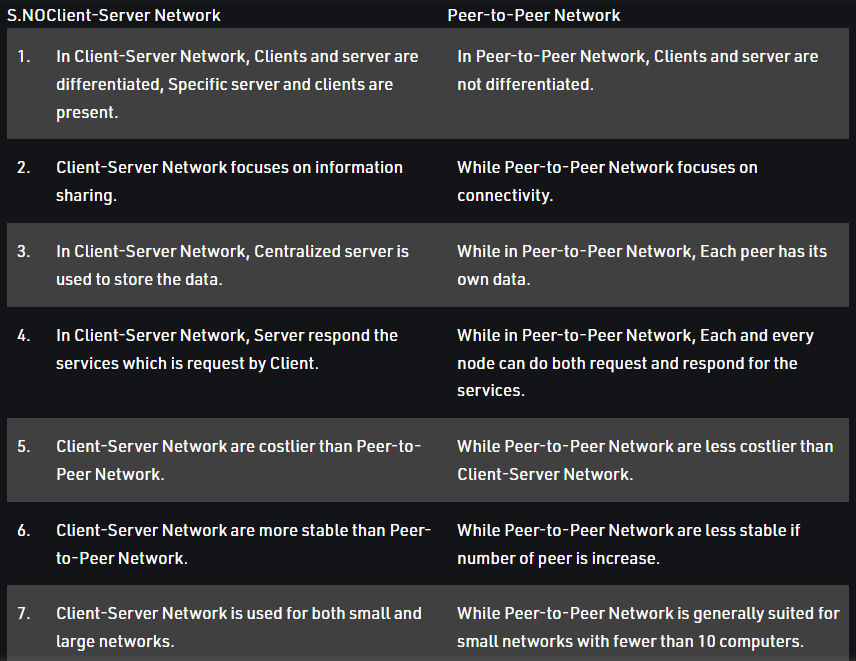
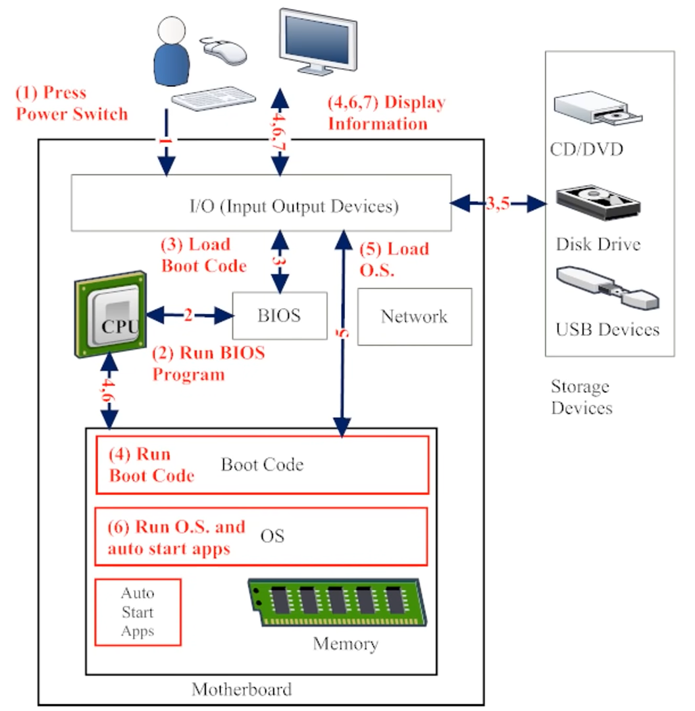
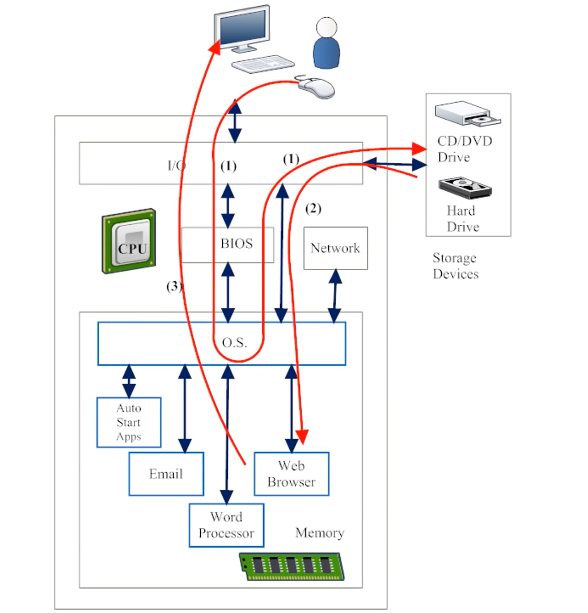

## Introduction to Computer Network

- **Network** is a connection of multiple network devices via any medium.
  - Devices are linked in order to share resources(such as printers and CDs), exchange files, or allow electronic communications.
  - The computers on a network may be linked through cables, telephone lines, radio waves, satellites, or infrared light beams.
- Computer Network is a group of computers that use a set of common _communication protocols_ over digital interconnections for the purpose of sharing resources located on or provided by network nodes.
  - PAN(Personal Area network), LAN(Local area network), CAN(Campus area network), MAN(Metropolitan area network), WAN(Wide area network).
  - `LAN(Local area network)` is established over a local area network like home(using mobile wifi), small offices etc.
  - `MAN(Metropolitan area network)` is established for a larger geographical area than a LAN, ranging from several blocks of buildings to entire cities.
  - `WAN(Wide area network)` is established two or more LANs connected together. The LANs can be many miles apart.
    - Multiple LANs can be connected together using devices such as bridges, routers, or gateways, which enable them to share data.
    - The world's most popular WAN is the Internet.
- **Networking** is a process of communnication/transmission of data between devices.
  - **Internetworking** is the connection of more than two network.
    
- Computer Networking is the name given to the full scope of how computers communicate with each other.

## OSI Model

- Open systems interconnection basic reference model (OSI reference model or OSI model) is an abstract description for layered communications and computer network protocol design.
- It divides network architecture into seven layers which, from top to bottom, are the application, presentation, session, transport, network, data-link, and physical layers.
  - It is often referred to as the OSI seven layer model.
    
    

## Basic Networking Terminologies

- Any system or device connected to a network is called a **node**.
- Each device on the network has a network address such as a _MAC address_ which uniquely identifies it.
- In a wired computer networking(including the internet) a _hop_ occurs when a packet is passed from one network segment to next.
  - Hop count refers to the number of intermediate devices through which data must pass between source and destination.
- Terminal is an interface where we can input instruction using commands(set of instructions which does a particular task).
  - A command can be issued via a CLI such as shell or as input to a network services as part of a network protocal or as an event in a GUI triggered when user select an option in a menu.
- **Shell** is computer program that presents a CLI which allow us to control the computer using commands.
- **Virus** is a program(bad program) that is harmful to the system and information.
- An **Operating System (OS)** is an interface between a computer user and computer hardware.

## Common Cybersecurity Terminology

- Hackers VS Script-Kiddie VS Hactivist
- Attack and Attack code
- Cyber Criminals
- C-I-A model (Confidentiality Integrity Availability)
- Risk
- Threats
- Vulenerability
- Impact
- Exploit
- Zero-day exploit
- Nation States
- Malicious insider

## Demystifying Computers

- Four Layers of a Computer System
  - User
  - Hardware
  - OS
  - Software(Application)
- Electricity will flow from the power socket to the hardware devices like Tower, Monitor, Printer and from Tower to mouse and keyboard. From the Cables connecting Everything from the Tower the data transfer takes place(In case of keyboard and mouse both the data transfer and electricity flow will take place from USB cable). The Data is tranfered from Tower to Monitor and Printer (output devices) and from keyboard and mouse (input devices) to Tower. Finally the user is able to trade information with other computers via Internet connection.
- Tower contains Motherboard, CPU, I/O card, Network Connection, Memory (RAM), HardDrive (Storage).
- What happen when we switch on our PC
  
- What happen when we load an application
  
  - An active application can potentially access anything the OS can access and as OS have the access to all the files in our system, any active application may also potentially access any peice of information in our system.

## Demystifying Internet

- The Internet is **a vast network that connects computers all over the world**. Using the Internet, one can share information and communicate from anywhere with an Internet connection.
- Internet Service Providers (ISP) are the organizations that owns the cables and networking devices that the internet runs on.
- Strict and fixed set of communication rules for any two computers to communicate is called communication protocols.
  - The internet's communication protocol is called Internet protocol (IP).
  - Every device connected with the internet will have an IP address(unique address) assigned to it.

## Hash Functions

- Passwords in databases are stored in hashed form using hash function.
  - Hash functions will take a string and convert it into a gibrish value, the best thing about this is it's only one way i.e. one can't get the string back from the gibrish.
  - Hash functions are irreversible.
- Prime numbers are used a lot in cryptography.

## Common Password Threats

- User Disclosure
- Social Engineering
- Phising
- Key logging(Hardware and Software)
- Wireless sniffing
- Brute Force (Guessing)
- Dictionary attack
- Password Files not Encrypted (That's when hash functions are used)
- Exposed Password with known hash value (That's when salts are used)
- Security Question

## Creating a Good Password

- A good password should be strong as well as easy to remember.
- To make the password strong one should add letters both lowercase and uppercase with digits and special characters.
- To make the password memorable make it tell a story.
- Password management Tips
  - Securely Record your Password
  - Rank your Password
  - Use Password management Software
