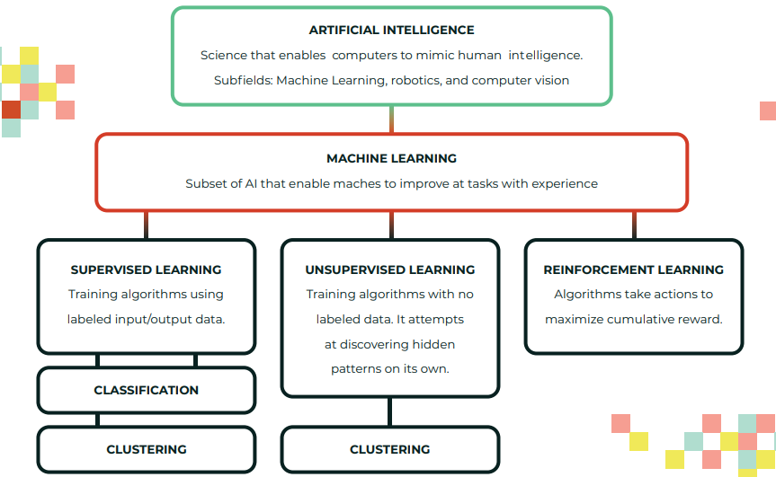
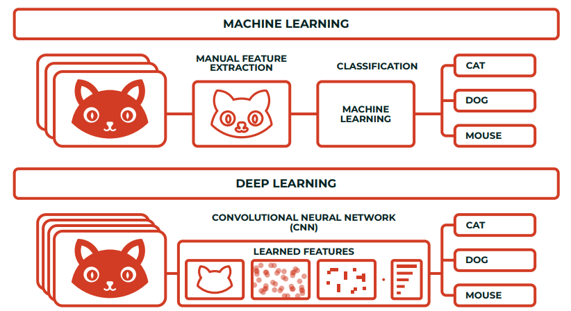
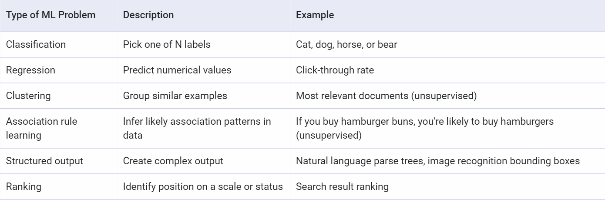
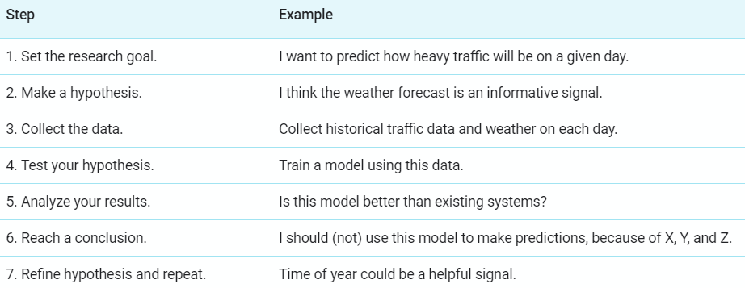
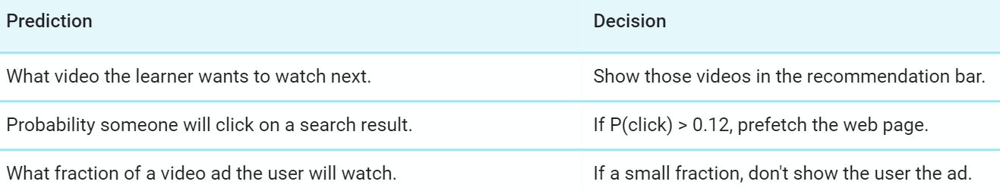

# What is ML

ML is the process of training a piece of software, called a **model**, to make useful predictions using a data set. This predictive model can then serve up predictions about previously unseen data.

- eg. the system predicts that a user will like a certain video, so the system recommends that video to the user.

**Model**: The representation of what a machine learning system has learned from the training data. It defines the relationship between features and label. We can think of model as a function whose input is the features and the output is label.

# AI VS ML VS DL

AI is science that empowers computers to mimic human intelligence such as decision making, text processing, and visual perception.

- AI is a broader field (i.e. the big umbrella) that contains several subfield such as machine learning, robotics, and computer vision.

  

Machine Learning is a subfield of Artificial Intelligence that enables machines to improve at a given task with experience.

- It is important to note that all machine learning techniques are classified as Artificial Intelligence ones. However, not all Artificial Intelligence could count as Machine Learning since some basic Rule-based engines could be classified as AI but they do not learn from experience therefore they do not belong to the machine learning category.

Deep learning is a specialized field of machine learning that relies on training of Deep Artificial Neural Networks (ANN) using a large dataset such as images or texts.

- ANNs are information processing models inspired by the human brain. The human brain consists of billions of neurons that communicate with each other using electrical and chemical signals and enables humans to see, feel, and make descision.
- ANN works by mathematically mimicking the human brain and connecting multiple "artificial" neurons in a multilayered fashion.
- The more hidden layers added to network, the deeper the network gets.

ML process

1. Selecting the model to train.
2. Manually performing feature extraction.

DL process

1. Selecting the architecture of the network.
2. Features are automatically extracted by feeding in the training data (such as images) along with the target class (label).

# What is RL

Reinforcement learning is an active field of ML research.
In RL one don't collect examples with labels.

- Imagine you want to teach a machine to play a very basic video game and never lose. You set up the model (often called an **agent** in RL) with the game, and you tell the model not to get a "game over" screen.
  During training, the agent receives a reward when it performs this task, which is called a **reward function**. With reinforcement learning, the agent can learn very quickly how to outperform humans.
  Designing a good reward function is difficult, and RL models are less stable and predictable than supervised approaches.

# Machine Learning Model

ML problems falls along a spectrum of supervision between **supervised** and **unsupervised** learning.

## Supervised Machine Learning

Supervised learning is a type of ML where the model is provided with **labeled** training data containing features and a label.

Features are variables that describe our data, the label(Typically represented by the variable **y**.) is essentially the answer of ML problem or what a particular set of feature should predict or the output variable.

- Basically feature is an input variable used in making predictions. Typically represented by the variables **{x1, x2, ..., xn}**.
- A particular **example**(one row of a dataset) to be feeded into model can have one or more features but only one label.

In **supervised machine learning**, one feed the features and their corresponding labels into an algorithm in a process called **training**. During training, the algorithm gradually determines the relationship between features and their corresponding labels. This relationship is called the **model**.

Supervised machine learning finds patterns between data and labels that can be expressed mathematically as functions.

Main Supervised Learning models are:

- A **regression** model predicts continuous values.
  - Some Regression models include Linear Regression, Lasso Regression, Polynomial Regression, SVM Regressor, Random Forest Regressor, Bayesian Linear Regressor etc.
- A **classification** model predicts discrete values.
  - Some Classification models include Logistic Regression, SVM classifier, Decision Tree, K-Nearest Neighbors, Random Forest, Naive Bayes Classifier etc.

An **example** is a particular instance of data, **x**. (We put **x** in boldface to indicate that it is a vector.) We break examples into two categories:

- labeled examples: A **labeled example** includes both feature(s) and the label, used for training our model.
- unlabeled examples: An **unlabeled example** contains features but not the label, for testing our model.

**Training** means creating or **learning** the model.

**Inference** means applying the trained model to unlabeled examples.

## Unsupervised Machine Learning

In **unsupervised learning**, the goal is to identify meaningful patterns in the data. To accomplish this, the machine must learn from an unlabeled data set.

The model has no hints how to categorize each piece of data and must infer its own rules for doing so.

This is helpful when working with unstructured data or where we want the model to find patterns.

Unsupervised learning is done mainly using clustering or association.

- **Clustering** is typically done when labeled data is not available. This is an _unsupervised_ learning problem.
  - For example, Google Photos uses clustering to group pictures of the same person together.

Some Unsupervised learning models include K means Clustering, Hierarchial Clustering, PCA, Apriori, Eclat etc.

## Classifying ML problems

# ML mindset

ML help programmer

- To reduce the time programming
- Customise and scale some products easily
- Help us do problems that seem unprogrammable.
- Changes the way a software engineer think about a problem.

Machine Learning changes the way you think about a problem. The focus shifts from a mathematical science to a natural science, **running experiments and using statistics**, not logic, to analyse its results.

Implementing ML is different than traditional programming.

- In traditional programming, you have set parameters and you understand how everything should behave.
- With ML, the non-coding work can be very complicated, but you'll usually write far less code.
- Eg. we can teach a model to recognize cats in photos, but it is difficult to know what features the model uses to determine something is in fact a cat.
- This uncertainty can feel a little uncomfortable at times if you are used to determining every detail of your code's behavior.

To address the challenges of transitioning to ML, it is helpful to think of the ML process as an experiment.

## A good ML Problem

Start with the problem, not the solution. Make sure you aren't treating ML as a hammer for your problems.

- Before trying to do everything with ML ask yourself these questions:
  1.  What problem is my product facing?
  2.  Would it be a good problem for ML?

ML requires a _lot_(that depends on the problem, but more data typically improves your model and therefore your model's predictive power) of relevant data.

- A good rule of thumb is to have at least thousands of examples for basic linear models, and hundreds of thousands for neural networks.
- If you have less data, consider a non-ML solution first.

Keep in mind that the features contains predictive power.

- The feature one descide depends on it's understanding of problem so be prepared to have your assumptions(based on problem's understanding) challenged.
- If you understand the problem clearly, you should be able to list some potential solutions to test in order to generate the best model.
- Understand that you will likely have to try out a few solutions before you land on a good working model.
- You should not try to make ML do the hard work of discovering which features are relevant for you.

Aim to make decisions, not just predictions.

- Decisions mean that the product should take action on the output of the model.
- For example, a model that predicts the likelihood of clicking certain videos could allow a system to prefetch the videos most likely to be clicked.
- ML is better at making decisions than giving you insights.
  

## Challenging ML problems

Meaning of each cluster in an unsupervised learning problem.

- For example, if your model indicates that the user is in the blue cluster, you'll have to determine what the blue cluster represents.

You can try to assign a meaning to a cluster, but this can be tricky because the model might not group by criteria that you find intuitive.

An alternative approach is to label some items before you cluster, and then try to propagate those labels across the entire cluster.

- For instance, if all items with label X end up in one cluster, maybe you can spread label X to other examples.

ML can identify correlations—mutual relationships or connections between two or more things.

- But it can't determine causation from only observational data.
- In general, you need to intervene in the world—run an experiment—to determine causation; you can't see it in purely observational data.
- For eg. Did consumers buy a particular book because they saw a positive review the week before, or would they have bought it even without that review?

If there are no patterns or only trivial patterns, then machine learning probably will not provide value.

If there are many patterns and it is important to make accurate predictions, then using machine learning might be the right approach.

# Tensors

## ND Tensor

# Saving Processed Data and Model to Disk

It can be useful to save processed data to disk, especially for really large datasets, to avoid repeating the preprocessing steps every time you start the Jupyter notebook.

- The parquet format is a fast and efficient format for saving and loading Pandas dataframes.

We can also save our trained model to disk, so that we needn't retrain the model from scratch each time we wish to use it.

- Along with that anything that will be required while generating predictions using the model should be saved like imputers, scalers, encoders and even column names.

- We can use the `joblib` or `pickle` module to save and load Python objects on the disk.

# Training, Validation and Test Sets

For training and testing purposes of our model, we should have our data broken down into three distinct dataset splits.

Training set of data that is used to train and make the model learn the hidden features/patterns in the data.

- The training set should have a diversified set of inputs so that the model is trained in all scenarios and can predict any unseen data sample that may appear in the future.

Validation set is a set of data, separate from the training set, that is used to validate our model performance during training.

- This validation process gives information that helps us tune the model’s hyperparameters and configurations accordingly.
- It is like a critic telling us whether the training is moving in the right direction or not.
- The main idea of splitting the dataset into a validation set is to prevent our model from overfitting.

The test set is a separate set of data used to test the model after completing the training.

- It provides an unbiased final model performance metric in terms of accuracy, precision, etc.

One has to come to a split percentage that suits the requirements and meets the model’s needs, the major concerns while deciding on the optimum split are:

- If there is less training data, the machine learning model will show high variance in training.
- With less testing data/validation data, your model evaluation/model performance statistic like accuracy, precision, recall, and F1 score will have greater variance.

There is no optimal split percentage but in general, putting 80% of the data in the training set, 10% in the validation set, and 10% in the test set is a good split to start with.

# Cross Validation

Any machine learning model needs to consistently predict the correct output across a variation of different input values, present in different datasets.

- This characteristic of a machine learning model is called **stability**.

A model can lose stability in two ways:

- Underfitting: It occurs when the model does not fit properly to training data. It does not find patterns in the data and hence when it is given new data to predict, it cannot find patterns in it too. It under-performs on both known and unseen data.
- Overfitting: When the model trains well on training data and generalizes to it, but fails to perform on new, unseen data. It captures every little variation in training data and cannot perform on data that does not have the same variations.

While choosing machine learning models, we need to compare models to see how different models perform on our dataset and to choose the best model for our data.

- However, data is usually limited, our dataset might not have enough data points or may even have missing or wrong data.
- If we have fewer data, training, and testing on the same portion of data does not give us an accurate view of how our model performs.

Cross-Validation in machine learning is a technique that is used to train and evaluate our model on a portion of our database, before re-portioning our dataset and evaluating it on the new portions.

- Using cross-validation in machine learning, we can determine how our model is performing on previously unseen data and test its accuracy.

In this technique instead of splitting our dataset into two parts, one to train on and another to test on, we split our dataset into multiple portions, train on some of these and use the rest to test on.

The general idea/working of cross validation includes following steps:

- Split the data into train and test sets and evaluate the model’s performance/accuracy.
- Above step is repeated multiple times until the model has been trained and evaluated on the entire dataset. This way not just one specific portion is train-test but the entire dataset is used sometimes for train and sometimes for test.
- To get the actual performance metric the average of all measures is taken

There are various ways to perform cross-validation. Some of the commonly used models are:

- **K-fold cross-validation**: In K-fold cross-validation, K refers to the number of portions the dataset is divided into which is selected based on the size of the dataset.

  - The dataset is split into k portions one section is for testing and the rest for training.
  - Training and Testing will continue K number of times until all sections have been used as a testing set once.
  - The final performance measure will be the average of the output measures of the K iterations.

- **Leave one out cross-validation (LOOCV)**: In LOOCV, instead of leaving out a portion of the dataset as testing data, we select one data point as the test data.

  - The rest of the dataset will be used for training and the single data point will be used to predict after training.
  - Again this training and testing will be repeated for the rest of the dataset, i.e.: N times.
  - The final performance measure will be the average of the measures for all n iterations.

- **Stratified K-fold cross-validation**: In some cases, while partitioning the data, some testing sets will include instances of minority classes while others will not.
  - This method is useful when there are minority classes present in our data.
  - When this happens, our accuracy will not properly reflect how well minority classes are being predicted.
  - To overcome this, The data is split so that each portion has the same percentage of all the different classes that exist in the dataset.

# Curse of Dimensionality

The impact of having more dimensions in the model, which is nothing but having multicollinearity in the data can lead to overfitting, and this exposes the model to have variance errors, that is the model may fail to perform or predict for new unseen data.

The issues caused by this are decrease in performance and higher computation.

## Dimensionality Reduction

The major dimentionality reduction techniques includes Feature selection and Feature extraction.

Feature selection

- Forward Selection
- Backward Elimination

Feature extraction

- PCA
- LDA
- t-SNE

# Bias-Variance Trade-off

There will always be a slight difference in what our model predicts and the actual predictions. These differences are called errors.

- The goal of an analyst is not to eliminate errors but to reduce them.
- There is always a tradeoff between how low you can get errors to be.

There are two main types of errors present in any machine learning model. They are Reducible Errors and Irreducible Errors.

- Irreducible errors are errors which will always be present in a machine learning model, because of unknown variables, and whose values cannot be reduced.
- Reducible errors are those errors whose values can be further reduced to improve a model.
  - They are caused because our model’s output function does not match the desired output function and can be optimized.
  - We can further divide reducible errors into: Bias and Variance.

While discussing model accuracy, we need to keep in mind the prediction errors, i.e.: Bias and Variance.

Bias is the difference between our actual and predicted values. It is the simple assumptions that our model makes about our data to be able to predict new data.

- When the Bias is high, assumptions made by our model are too basic, the model can’t capture the important features of our data.

When the model cannot find patterns in our training set and hence fails for both seen and unseen data, is called Underfitting.

For any model, we have to find the perfect balance between Bias and Variance.

- This just ensures that we capture the essential patterns in our model while ignoring the noise present it in.
- This is called Bias-Variance Tradeoff.
- It helps optimize the error in our model and keeps it as low as possible.

Overfitting and Underfitting

Ways:

- Regularization
- Bagging
- Boosting

# Regularization

One efficient way to avoid overfitting.

L1 (Lasso) and L2 (Ridge) are the common regularization techniques used to address over-fitting and feature selection.

# Dummy Variable and One Hot Encoding

# Loss Function and Performance Metrics

# End to end ML pipeline to solve real-world industry problems

Any intelligent system basically consists of an end-to-end pipeline starting from ingesting raw data, leveraging data processing techniques to wrangle, process and engineer meaningful features and attributes from this data. Then we usually leverage techniques like statistical models or machine learning models to model on these features and then deploy this model if necessary for future usage based on the problem to be solved at hand.

The data analysis phase is explained in detail [here](./Data%20Analysis/).

Some machine learning models/algorithms are explained in detail [here](./Machine%20Learning%20Algorithms) and their implementations in the notebook [here](./ML%20Models%20Notebook/).
