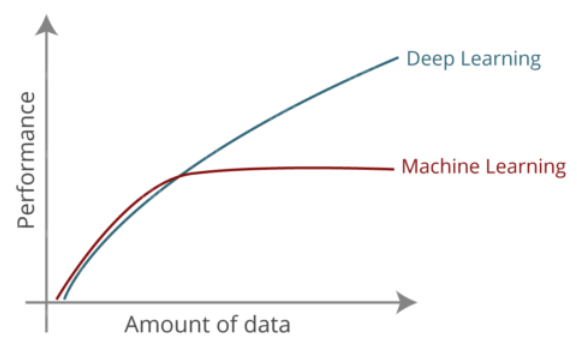

# Introduction

Started in 1960's Deep Learning is a subfield of Artificial Intelligence and Machine Learning that is inspired by the structure of human brain.

Deep learning algorithms attempt to draw similar conclusions as humans would by continually analyzing data with a given logical structure called Neural Network.

- Neural Network is inspired by the structure of human brain.
- Examples of some Deep learning models are ANN, CNN, RNN, GAN etc.

This is also be said to be a part of a broader family of machine learning methods based on artificial neural network with representation learning.

Deep Learning Algorithms uses multiple layers to progressively extract higher-level features from the raw input.

- For example, in image processing, lower layers may identify edges, while higher layer may identify the concepts relevant to a human such as digits or letters or faces.

## Why DL

**Applicability**: Can be applied to a wide domain of problems.

**Performance**: state of the art

### Why it's Popular now?

**Dataset**: With the boom of Internet era data also boomed and hence we have lot of data and not just data but labelled data.

- Some examples of popular public dataset in major fields:
  - Text: SQuad
  - Image: Microsoft Coco
  - Video: Youtube 8M
  - Audio: Google Audioset

**Hardware**: For different devices we can use different and custom hardwares.

- **Moore's law**: Moore the co-founder of Intel said that the number of transistors in a dense integrated circuit (IC) doubles about every two years.
- For large dataset one can use GPU, TPU.
- For Mobile one can use Mobile CPU, GPU, DSP or NPU.
- For Smart watch or glass one can use Edge TPU, NPU.

**Framework/Libraries**: TensorFlow, Keras, PyTorch and UI based drag and drop systems like AutoML.

**Architecture**

- Transfer Learning.
  - Text Classification: BERT
  - Image Classification: ResNET
  - Image Segmentation: UNet
  - Image Translation: Pix2Pix
  - Object Detection: YOLO
  - Speech Generation: WaveNET

**Community**

## AI VS ML VS DL

AI is any technique that enables computer to mimic human behaviour.

ML is ability to learn without explicitly being programmed.

DL is extracting patterns from data using neural networks.

### DL VS ML

**Data Dependency**: Deep learning requires more amount of data.



**Hardware Dependency**: DL require powerful GPUs (costly hardware) while ML models can be trained with CPU.

**Training Time**: Training time with DL is quite high.

**Feature Selection**: With Representation learning DL extracts features automatically

**Interpretability**: DL is like a black box and hence fails for interpretability because we don't know what learning was done by DL to come to a conclusion.

## Application of DL

Self Driving Car

Game Playing Agents

Virtual Assistance

Image Colorization

Adding audio to mute videos

Image Caption Generation

Text Translation

Pixel Restoration

Object Detection

Generate Audio, Video, Image, Text using GAN

# Types of Neural Network

Artificial Neural Networks(ANN)/MLP (Multilayer Perceptron) for Regression and classification

Convolutional Neural Networks(CNN) for Computer Vision i.e. used in Image and Video Processing.

Recurrent Neural Networks(RNN) for Time Series analysis

Self-organizing maps for Feature extraction

Deep Boltzmann machines for Recommendation systems

Auto Encoders for compression without losing the quality

GAN (Generative adversarial network)

# Perceptron

A neural network link that contains computations to track features and uses Artificial Intelligence in the input data is known as Perceptron. This neural links to the artificial neurons using simple logic gates with binary outputs.

A Perceptron is an ML algorithm for supervised learning of binary classifiers. Furthermore, Perceptron also has an essential role as an Artificial Neuron or Neural link in detecting certain input data computations in business intelligence.

The Perceptron algorithm learns the weights for the input signals in order to draw a linear decision boundary.

## History

An artificial neuron is a mathematical function based on a model of biological neurons, where each neuron takes inputs, weighs them separately, sums them up and passes this sum through a nonlinear function to produce output.

It is an elementary unit in an artificial neural network.

## Geometric Intuition of Perceptron

Line, Plane and Hyperplane

**Weight shows the strength of a particular node.**

Limitation of only linearly separable dataset

## Types of Perceptron

There are 2 major types of perceptron

- **Single layer**: The main objective of the single-layer perceptron model is to analyze the linearly separable objects with binary outcomes.
  - Single layer perceptron can learn only linearly separable patterns.
  - Being a supervised learning algorithm of binary classifiers, we can also consider it a single-layer neural network with four main parameters: input values, weights and Bias, net sum, and an activation function.
  - It can’t work with non-linear patterns like in XOR gate.
- **Multilayer**: It is mainly similar to a single-layer perceptron model but has more hidden layers so it can learn from two or more layers having a greater processing power.
  - A multilayer perceptron model has a greater processing power and can process linear and non-linear patterns.
  - It also implements logic gates such as AND, OR, XOR, XNOR, and NOR.
  - It is tough to predict how much the dependent variable affects each independent variable.
  - The model functioning depends on the quality of training.

## Perceptron VS Neuron

It is said that DL is heavily inspired by human's nervous system and hence it is a good idea to compare Perceptron with Neuron.

Neurons are interconnected nerve cells in the human brain that are involved in processing and transmitting chemical and electrical signals.

- Dendrites are branches that receive information from other neurons.
- Cell nucleus or Soma processes the information received from dendrites.
- Synapse is the connection between an axon and other neuron dendrites.
- Axon is a cable that is used by neurons to send information.

An artificial neuron invokes the mathematical function and has node, input, weights, and output equivalent to the cell nucleus, dendrites, synapse, and axon, respectively, compared to a biological neuron.

Perceptron is weakly inspired by Neuron the reason to say that are:

- Neuron is quite complex.
- The internal processing in the Nucleus is unknown.
- Neuroplasticity

# Training Perceptron


As all inputs are densely connected to all outputs, these layers are called **Dense Layers**.

The core steps for training a perceptron are:

- Dot product of weights and inputs
- Bias

- Non-linearity (activation function): This activation function is also known as the step function.
  - Some Common Activation Function are:
    - Step Function
    - Sign Function
    - Sigmoid: The S-curve.
    - Hyperbolic Tangent
    - Rectified Linear Unit (ReLU): This is the most popular activation function in DL.
      - A smooth approximation to the rectifier is the Softplus function.
      - The derivative of Softplus is the logistic or sigmoid function.
    - Softplus
    - Softmax
      > All activation functions are non-linear.
      > If we do not apply activation function then the output signal would be simply linear function(one-degree polynomial). Now, a linear function is easy to solve but they are limited in their complexity, have less power. Without activation function, our model cannot learn and model complicated data such as images, videos, audio, speech, etc.
      > An in-depth explaination on activation functions can be seen on [https://www.theaidream.com/post/an-overview-of-activation-functions-in-deep-learning](https://www.theaidream.com/post/an-overview-of-activation-functions-in-deep-learning).


# \***\*How do Neural networks learn?\*\***

A perceptron model is also classified as one of the best and most specific types of Artificial Neural networks.

Learning in a neural network is closely related to how we learn in our regular lives and activities — we perform an action and are either accepted or corrected by a trainer or coach to understand how to get better at a certain task.

Neural networks require a trainer in order to describe what should have been produced as a response to the input. Based on the difference between the actual value and the predicted value, an error value also called **Cost Function** is computed and sent back through the system.

## Loss Functions

The loss of a neural network measured the cost incurred from incorrect predictions.

The **empirical loss** measures the total loss over our entire dataset.

- It is also known as Objective function, Cost function, empirical risk.

**Cross entropy loss** can be used with models that output a probability between 0 and 1.

**Mean squared error loss** can be used with regression model that outputs continuous real numbers.

For each layer of the network, the cost function is analyzed and used to adjust the threshold and weights for the next input. Our aim is to minimize the cost function.

Our goal is to find the network weights that achieve the lowest loss.

There are basically 2 ways to adjust weights:

1. Brute-force method
2. Gradient Descent


Neural networks may be used for a variety of different concepts and ideas, and learn through a specific mechanism of backpropagation and error correction during the testing phase. By properly minimizing the error, these multi-layered systems may be able to one day learn and conceptualize ideas alone, without human correction.

# Perceptron Learning Rule

Perceptron Learning Rule states that the algorithm would automatically learn the optimal weight coefficients.

In the Perceptron Learning Rule, the predicted output is compared with the known output. If it does not match, the error is propagated backward to allow weight adjustment to happen.

EPOCHS and Convergence

**Algorithm**

```python
# M1
for i in EPOCHS:
	data = dataset.random()
	Wn = Wo + n(Yi - Yio)Xi

# M2
while convergence:
	data = dataset.random()
	Wn = Wo + n(Yi - Yio)Xi
```

## Concept of learning rate

Small learning rate converges slowly and gets stuck in false local minima.

Large learning rate overshoots become unstable and diverges.

Stable learning rate converges smoothly and avoid local minima.

One way to have a stable learning rate is by having to try a lot of learning rate and see what works best for the case (brute-force) other way is to have an adaptive learning rate.

# Issue of Overfitting and Regularization

Dropout, Early Stopping
