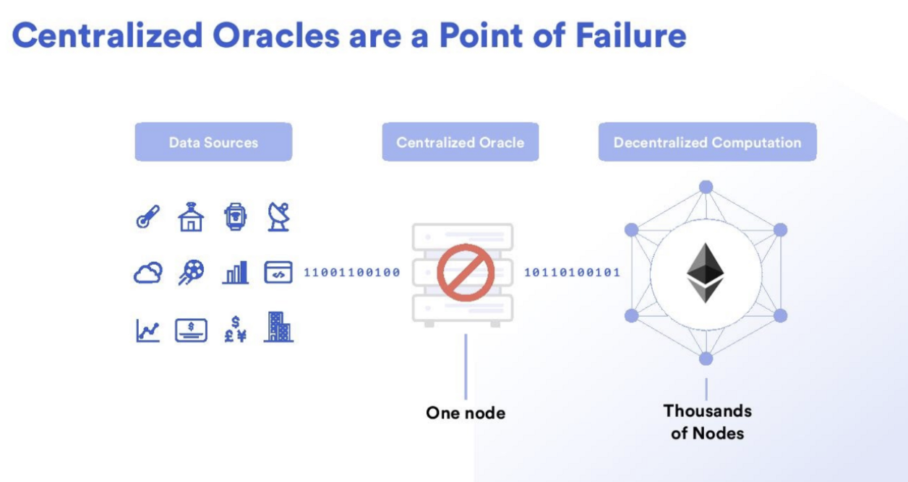
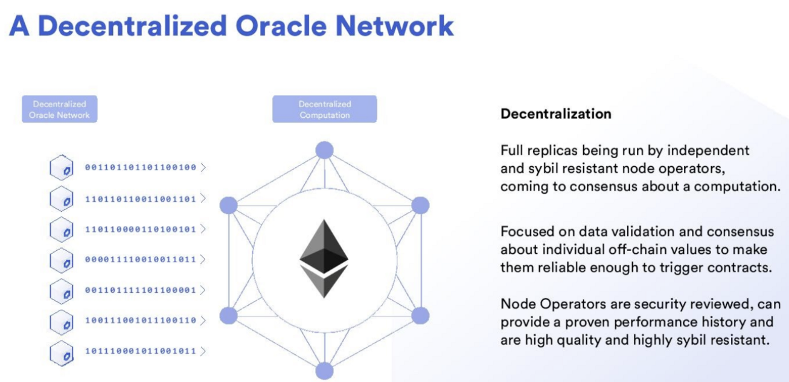
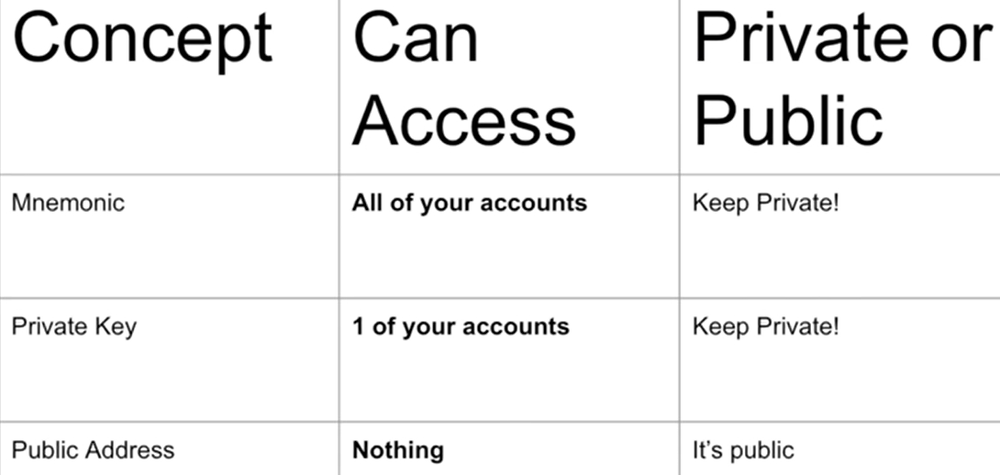
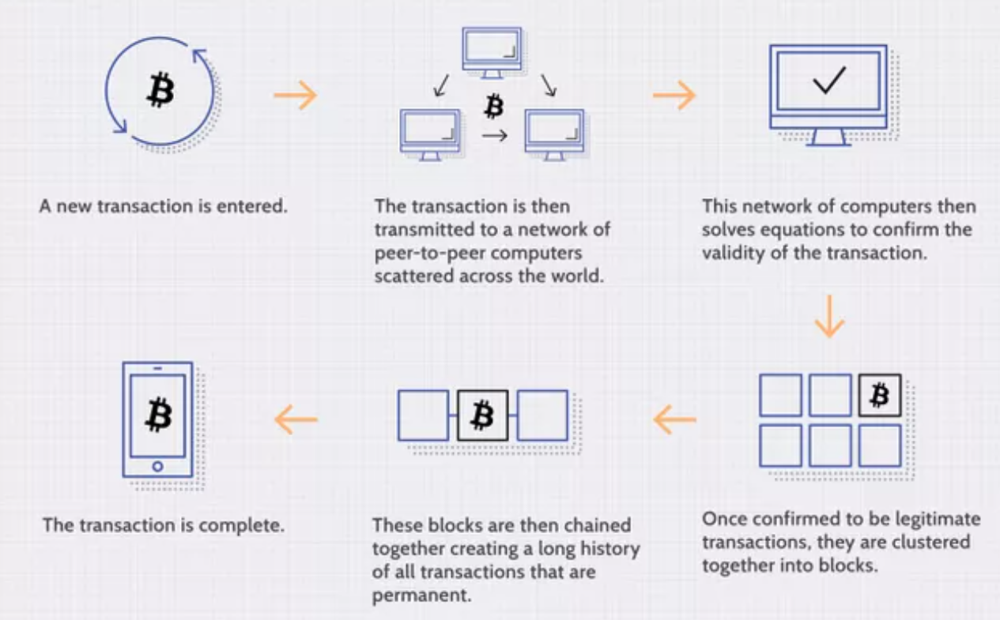

## Credits

- These are notes and my understanding of Blockchain and Blockchain programming using JS from the Patrick Collins' freecodecamp course.

## What is Blockchain

- A **Blockchain** is a distributed database that is shared among the nodes of a computer network and protected by crytography.

  - `It stores information in blocks that are then linked together via cryptography`.
  - Different types of information can be stored on a blockchain, but the most common use so far has been as a ledger for transactions.
  - It guarantees the fidelity and security of a record of data and generates trust without the need for a trusted third party.
  - Decentralized blockchains are immutable, which means that the data entered is irreversible.

- Unlike traditional database instead of storing data in tables, a blockchain structures its data into chunks (blocks) that are strung together.

  - Each block in the chain is given an exact time stamp when it is added to the chain.
  - Blocks have certain storage capacities and, when filled, are closed and linked to the previously filled block, forming a chain of data known as the blockchain.
  - All new information after that freshly added block is then again compiled/grouped into a new block which will then also be added to the chain.

- A blockchain is a globally shared, transactional database.

  - This means that everyone can read entries in the database just by participating in the network.
  - If you want to change something in the database, you have to create a so-called **transaction** which has to be accepted by all others.
  - The word transaction implies that the change you want to make is either not done at all or completely applied.
  - While your transaction is being applied to the database, no other transaction can alter it.

- **Smart contract** is a self-executing set of instructions that is executed without a third party intermediary.

  - Smart contracts are a set of instructions which when placed on a blockchain are self-executing pieces of code not run by any centralized intermediary.
  - They are written in code.
  - Smart contracts are typically paired with some type of oracle to get some information about the real world, when smart contracts are paired with an oracle they're called _hybrid smart contracts_.
  - Chainlink is a secure decentralized modular oracle network used to bring data into your smart contracts and also make some type of external computation.

- **Oracles** are devices that bring data into a blockchain or execute some type of external computation.

  - It connects a deterministic blockchain with off-chain data.

- Blockchains alone can’t access outside data and using centralized oracles nullifies the advantage of smart contracts — and are major security risks this is Oracle Problem.
  

  - Decentralized oracles solve the oracle problem, one such example is chainlink.
    

- **Chainlink** is a decentralized modular oracle network that allows you to bring data into your smart contracts and do external computation.

  - It solves the Oracle Problem.
  - It allow for unlimited smart contract customization.
  - Chainlink is the most popular and powerful decentralized oracle network right now.
  - It is also blockchain/smart contract platform agnostic meaning it'll work on any blockchain or smart contract platform out there be it ethereum, avalanche, polygon, polkadot etc.

- **Hybrid smart contracts** have the on-chain settlement and interact with the real world in some meaningful way.

  - `Hybrid smart contracts combine code running on the blockchain (on-chain) with data and computation from outside the blockchain (off-chain) provided by Decentralized Oracle Networks`.
  - Hybrid smart contracts and smart contracts are often used interchangeably but if someone say hybrid smart contract it specifically mean a combination of decentralized on-chain logic settlement layer and any decentralized external off-chain data or computation.

- A Decentralised application is usually a combination of several smart contracts.

  - `Dapp = Smart Contract = Decentralised Application`.

- **Decentralized autonomous organizations**(DAO's) are organizations that live online in smart contracts, similar to regular organization in the traditional world however they have people who maybe hold governance tokens to make voting decisions or they do all their governance on chain on this decentralized settlement layer giving us the freedom to engage with each other as we please.

- Ethereum protocol has given rise to many new paradigms in industry including DiFi, NFT's DAO's(Decentralized Autonomous Organizations), Layer 2's etc.

  - Some other protocols like Polygon, Polkadot, Avalanche have taken this ethereum vision and gone in a different direction with it.

- Some `smart contract platforms aka blockchains` don't use solidity. But Ethereum is right now the most popular blockchain and it use solidity for smart contracts.

## Features and Advantages of Blockchains over traditional environment

- Blockchains are **decentralized** meaning there's no centralized source that controls the blockchain.

  - The individuals that make up blockchain are known as _node operators_.
  - They are the independent individuals running the software that connects the whole blockchain together, they make the blockchain and blockchain like networks decentralized.

- **Transperency and Flexibility**: Everything that's done on a blockchain, all the rules that are made can be seen by everyone. There's no special information that a few have, everyone has to play by the same rules and everyone can see exactly what those rules are.

  - Blockchain is pseudo-anonymous(public key generates the address which is the user's identity) so you can create different accounts and you can interact with it in many different ways.
  - Users of blockchains can remain anonymous while preserving transparency.

- **Speed and Efficiency**: As blockchains are verified by a decentralized collective the settlement is substantially faster and depending on the blockchain that you're using it can be from 10 minutes(Bitcoin) all the way down to just a couple of seconds(15 sec for Ethereum).

- **Security and Immutability**: Blockchains are immutable meaning they can't be changed. As they can't be tampered with or corrupted in any way, this allows us to have massive security on our data on our transactions and anything of the like.

  - There are thousands of nodes running the blockchain softwares meaning that everything that happens happens and is immutable and won't change.
  - On a blockchain it doesn't matter if several nodes go down as long as one node is running the entire system is running. The data is safe and secure.

- **Trust**: Smart contracts allow us to engage in trustless and trust minimized agreements.
  - Smart contracts are just programs so they allow us to move from brand based agreements(where we have to trust the brand) to math-based agreements(where we have to trust maths).
  - In math-based agreements we don't even have to trust anyone it's certain that the right thing will happen, hence the name trustless.

## Some important Concepts

- **Testnet blockchain** is a blockchain where the currency doesn't have any real value but it resembles and acts exactly like the main blockchain network so we can test and practice our applications aka smart contracts.

  - eg

- **Faucet** is a testnet application that give us free test tokens.

  - eg testnet ethereum.

- All transactions in a blockchain can be transparently viewed by either having a personal node or using blockchain explorers that allow anyone to see transactions occurring live.

  - **Block explorers** are applications that allow us to see details of things that happen on a blockchain.

    - eg Etherscan

- **Gas** refers to the fee paid to node operators for successfully including a transaction in a blockchain.

  - Gas is the measure of how much computation is used for a succesful transition. Every transition that happen on chain pays a gas fee to the node operator aka miner.
  - `Transition Fee = Gas used \* Gas Price`.
  - Gas price depends on how many people are doing the transition at a same time. The more the transition at a same time the more the gas price.
  - This comes with a scalability problem that as the number of users in the blockchain will increase the gas price will sky rocket.
  - Sharding and rollups are solution to scalability issues on layer 1.

- **Sharding** is a solution to this scalability problem where there's sharded blockchain which is just a blockchain of blockchains, there is a main chain that's going to coordinate everything amongst the chains that are in this main chain. This means that there's more chains for people to make transactions on, effectively increasing the amount of block space available.

- Layer 1 is any base layer blockchain implementation.
  - eg. Bitcoin, Ethereum, Avalanche etc.
- Layer 2 is any application that is added on top of layer 1 or blockchain.
  - eg. Chainlink, Optimism, Arbitrary etc.

## How Blockchain work

- Blockchain is a public _distributed_ _ledger_ protected using _cryptography_.

  - It is to allow digital information to be recorded and distributed, but not edited making it read only.

- **Hash** is a unique fixed length string meant to identify a peice of data.

  - A hash function is any function that can be used to map data of arbitrary size to fixed-size values.
  - The values returned by a hash function are called hash values, hash codes, digests, or simply hashes.
  - The same data will always produce the same hashed value.
  - Hashing algorithms include SHA-1, SHA-256, Keccak-256 etc.

- Every Blockchain client like bitcoin, ethereum etc give their miners a expensive computational problem to solve (like find a hash that starts with 4 zeros), the miner that finds the hash first will be given bonus. The hash is calculated with Data, Block number, Nonce, Previous block hash. Nonce is what the miner finds.

  - **Mining** is the process of finding the solution of the blockchain problem. Nodes are paid for mining blocks.

- Transactions are not guaranteed to be included in the next block or any specific future block, since it is not up to the submitter of a transaction, but up to the miners to determine in which block the transaction is included.

- If you want to schedule future calls of your contract, you can use a smart contract automation tool or an oracle service.

- Blocks in blockchain contains 3 main thing block number, nonce, data, timestamp, hash, and previous hash.

  - The first block of that blockchain is called **genesis block** so it don't contain the hash of it's previous block.

- As the blockchain is distributed(decentralised) so every node(computer) in the network(P2P network) will have the same ledger. So even if one node is hacked and gets corrupted data, the other nodes can verify it.

  - It takes 2/3 of nodes to be corrupted in the same way to get hacked.

- **Private-Public key**

  - Private key is only known to the key holder and is used to sign the transition(digital signature).
  - Public key is derived from the paired private key using complex maths, this is used to verify the transition.
  - The only way to sign a transition is by a private key, the sign is basically a hash that is encrypted using private key with the transition data. That signature can later be verified using the paired public key for decryption. As only the paired private key's encrypted data can be decrypted using the public key.
  - The public key makes the address of the user which guarantee anonimity.
  - Private key is randomly generated > Public key is generated from private key > Address is some derivation of public key.

  

- A `node` is a single instance of a decentralized network. The best part is anyone can join the network.

- **Consensus** is the mechanism used to agree on the state of blockchain.

  - Consensus is one of the key ingredients that make blockchain work in the first place.
  - `Chain Selection` basically mean which chain to believe on or how to descide which blockchain is the real blockchain.
  - `Sybil Resistance` is a blockchain's ability to defend against users creating a large number of pseudo-anonymous identities to gain a disproportionately advantageous influence over said system(`sybil attack`), basically so that someone don't create multiple nodes and get more bonus.
    eg. Proof of work and Proof of stake.
  - **Proof of work** is Sybil resistant because a single node has to go through a very computationally expensive process called mining to figure out the answer to the blockchain's riddle of finding that correct nonce or whatever the blockchain system has in place.
    - Block time is the time taken between blocks being published and is proportional to how hard these problems are.
    - Proof of work uses a lot of energy because in this system all the nodes called miners are competing against each other to find the answer to the blockchain riddle as whoever finds it first will get the paid as reward.
    - The payment is done in 2 ways one the block reward given by blockchain to add the block, the other is transition fee by user to add their transition to the block.
  - **Proof of stake** is another sybil resistant consesus where instead of solving a difficult problem, nodes called validators put up some collateral that they're going to behave honestly, in the example of ethereum validators put up some ethereum as a stake that they're going to behave honestly in the network, if they misbehave in the network some of their stake are going to be slashed or removed.
    - Unlike proof of work where every node is racing to be the first one to find the block, in proof of stake nodes are actually randomly chosen to propose the new block and then the rest of the validators will validate if that node has proposed the block honestly.
    - How random nodes are chosen vary from blockchain to blockchain.
  - **Nakamoto consensus** used by ethereum and bitcoin is a combination of proof of work and longest chain rule, the decentralized network decides that whichever blockchain has the longest chain or the most number of blocks on it is going to be the chain that they use.
  - eg. Proof of Work (PoW) with Nakamoto Consensus or Proof of Stake (PoS) with Byzantine Consensus.

- To validate new entries or records to a block, a majority of the decentralized network’s computing power would need to agree to it. To prevent bad actors from validating bad transactions or double spends, blockchains are secured by a consensus mechanism such as proof of work (PoW) or proof of stake (PoS). These mechanisms allow for agreement even when no single node is in charge.
  

- Attack on blockchain include Sybil attack and 51% attack.
