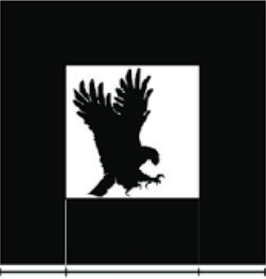
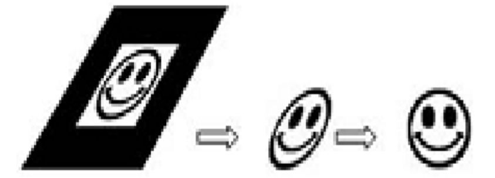
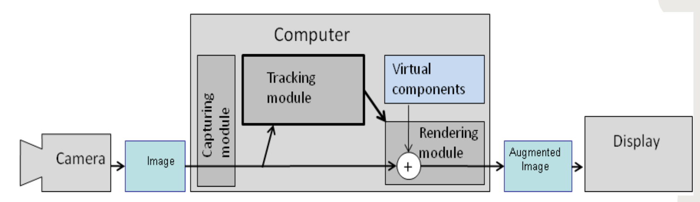
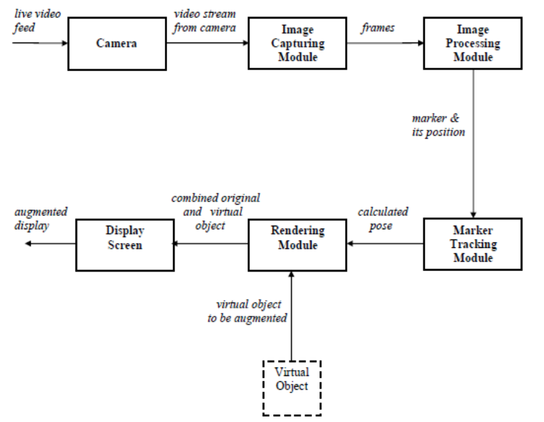

# **Augmented Reality**

Augmented reality is an interactive experience of a real-world environment where the objects that reside in the real world are enhanced by computer-generated perceptual information, sometimes across multiple sensory modalities, including visual, auditory, haptic, somatosensory and olfactory.

In augmented reality, virtual information and objects are overlaid on the real world.

You can access the experience through AR glasses or via screens, tablets, and smartphones. This means users are not isolated from the real world and can still interact and see what’s going on in front of them.

Examples: Pokémon GO, ARLoopa, Ikea Place

# **Types of Augmented Reality**

Marker-Based Augmented Reality: This type of AR works on the concept of tracking and recognition. In this type of AR you need to have a marker through which you could perform the augmentation. In short this is augmenting Digital Objects upon a marker.

Marker-Less Augmented Reality: This type of AR doesn’t requires any sort of marker. This AR can simply detect your plane and perform the augmentation of your digital objects. Examples: Ikea Place.

- Super Imposition AR: It is the augmented reality technique which uses object recognition. The augmented image replaces the original image either partially or fully. This type of AR is commonly used in the medical field to superimpose an X-ray onto a patient's body.

- Location Based AR: It ties digital content and the experience it creates to a specific place. The objects are mapped out so that when a user's location matches the predetermined spot it is displayed on the screen.

- Projection Based AR: It is a little different than the other types of markerless augmented reality. Namely, you don’t need a mobile device to display the content. Instead, light projects the digital graphics onto an object or surface to create an interactive experience for the user. Holograms! Projection-based AR is used to create 3D objects that can be interacted with by the user. It can be used to show a prototype or mockup of a new product, even disassembling each part to better show its inner workings.

- Outlining AR: Outlining AR recognizes boundaries and lines to help in situations when the human eye can’t. Outlining augmented reality uses object recognition to understand a user’s immediate surroundings. Think about driving in low light conditions or seeing the structure of a building from the outside.

# **Development Tools**

## **Development Engines**

- Unity
- Unreal
- Godot
- Cry Engine
- Spark AR Studio
- Lens Studio
- Apertus VR

## **Software Development Kit**

- ARCore (Google)
- Kudan
- ARKit (Apple)
- Vuforia
- Maxst
- 8th Wall
- Lighship
- EasyAR
- Wikitude

# **Marker Based Augmented Reality**

Marker based AR works on the concept of both Recognition and Tracking.

Here we need to have a marker through which you can perform the augmentation.

Recognition is the identification of any object/media like face recognition.

Tracking in AR finds a specific pattern or image that an app can recognize.

- Once the pattern is found it is constantly tracked (the AR constantly track the position of the pattern in the real world space) so that the app can accurately place the digital object on the marker that is being tracked.

Markers are generally square shaped and many people make use of black bordered image inside the main frame with white color inside of it. This helps to separate marker from the background frame. Internal graphics of marker are often displayed distorted or pixelated.

When recognizing the image it is neccessary to apply image unwrapping. Image unwrapping is the process to unwrap a part of image.

## **Marker Based AR System Architecture**

**<u>`A More Detailed look at the system architecture.`</u>**

Input to the **Image capturing module** is the live feed from the camera. This module analyses the camera feed, by analyzing each frame in the video.

- The module generates a binary image. These binary image are provided to the image processing module as the input.

Inputs to **Image Processing module** are the binary images from the Image caputring module. This module detects the AR using image processing techniques.

- Detection of AR marker is essential to determine the position, where to place the virtual object.
- Once the AR marker is detected, its location is provided as an input to Tracking module.

**Tracking module** is the core of the AR system. It calculates the realtive pose of the camera in real time.

- The term pose mean the 6D of position, that is the 3D location and orientation of an object.
- The calculated pose is provided as an input to rendering module.

**Rendering module** have 2 inputs, the calculated pose from rendering module and the virtual object to be augmented.

- It combines the original image and the virtual components using the calculated pose and renders the augmented image on the display screen of the mobile device.
