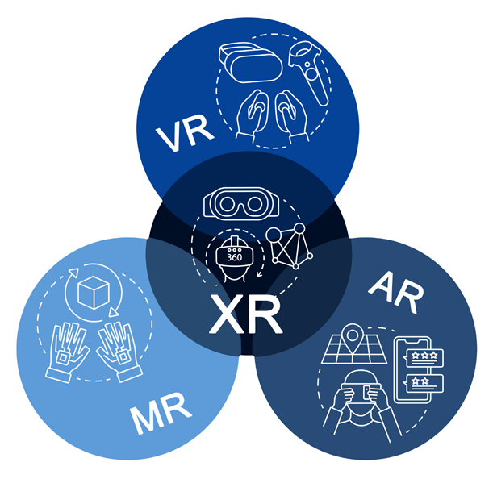
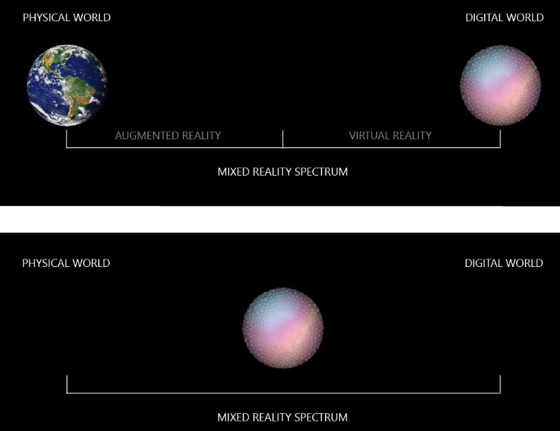
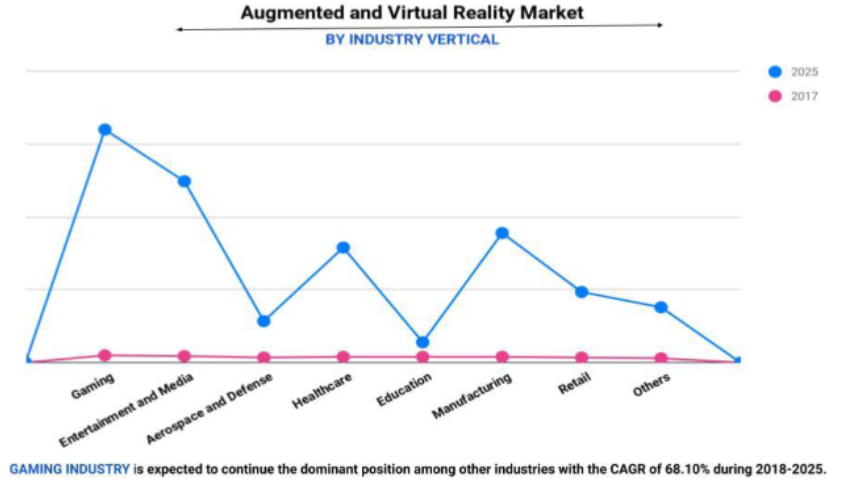

# **Introduction to Extended Reality**

Extended reality is a term referring to all real-and-virtual combined environments and human-machine interactions generated by computer technology and wearables.

XR is an emerging umbrella term for all the immersive technologies. The ones we already have today—augmented reality (AR), virtual reality (VR), and mixed reality (MR) plus those that are still to be created.

# **Sub Domains Of Extended Reality**

Augmented Reality (AR)
Virtual Reality (VR)
Mixed Reality (MR)

# **Augmented Reality**

Augmented reality is an interactive experience of a real-world environment where the objects that reside in the real world are enhanced by computer-generated perceptual information, sometimes across multiple sensory modalities, including visual, auditory, haptic, somatosensory and olfactory.

In augmented reality, virtual information and objects are overlaid on the real world.

You can access the experience through AR glasses or via screens, tablets, and smartphones. This means users are not isolated from the real world and can still interact and see what’s going on in front of them.

Examples: Pokémon GO, ARLoopa, Ikea Place

## **Types of Augmented Reality**

Marker-Based Augmented Reality: This type of AR works on the concept of tracking and recognition. In this type of AR you need to have a marker through which you could perform the augmentation. In short this is augmenting Digital Objects upon a marker.

Marker-Less Augmented Reality: This type of AR doesn’t requires any sort of marker. This AR can simply detect your plane and perform the augmentation of your digital objects. Examples: Ikea Place.

- Super Imposition AR: It is the augmented reality technique which uses object recognition. The augmented image replaces the original image either partially or fully. This type of AR is commonly used in the medical field to superimpose an X-ray onto a patient's body.

- Location Based AR: It ties digital content and the experience it creates to a specific place. The objects are mapped out so that when a user's location matches the predetermined spot it is displayed on the screen.

- Projection Based AR: It is a little different than the other types of markerless augmented reality. Namely, you don’t need a mobile device to display the content. Instead, light projects the digital graphics onto an object or surface to create an interactive experience for the user. Holograms! Projection-based AR is used to create 3D objects that can be interacted with by the user. It can be used to show a prototype or mockup of a new product, even disassembling each part to better show its inner workings.

- Outlining AR: Outlining AR recognizes boundaries and lines to help in situations when the human eye can’t. Outlining augmented reality uses object recognition to understand a user’s immediate surroundings. Think about driving in low light conditions or seeing the structure of a building from the outside.

# **Virtual Reality**

In contrast to augmented reality, in a virtual reality experience, users are fully immersed in a simulated digital environment.

It is the computer-generated simulation of a 3D image or environment that can be interacted with in a seemingly real or physical way by a person using special electronic equipment, such as a helmet with a screen inside or gloves fitted with sensors.

Examples: Beat Saber, STAND OUT : VR Battle Royale, Anatomyou.

VR Headsets like Oculus is called Head Mounted Displays(HMD’s).

# **Mixed Reality**

MR is advanced form of AR where we make use Head Mounted Displays(HMD’s) to display the content on top of real-world sort of blend into the real world.

In mixed reality, digital and real-world objects co-exist and can interact with one another in real-time. This is the latest immersive technology and is sometimes referred to as hybrid reality.

# **Extended Reality Market Size**

By 2022 the XR market is expected to reach $209 billion, which is eight times what it was in 2020. This tremendous growth could mean the realities of our 2030 lives are beyond our imagination’s ability to grasp.

Extended Reality (XR) Market Size to Reach USD 393 Billion by 2025 at 69.4% CAGR - Report by Market Research Future (MRFR).

